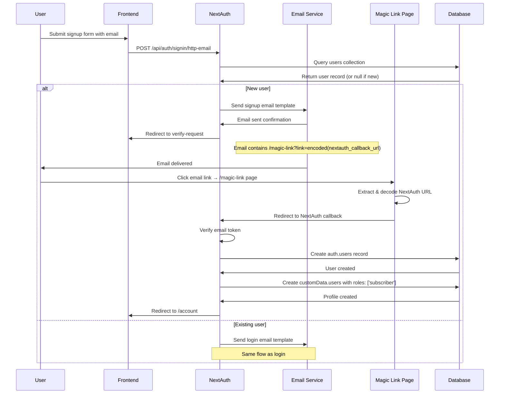
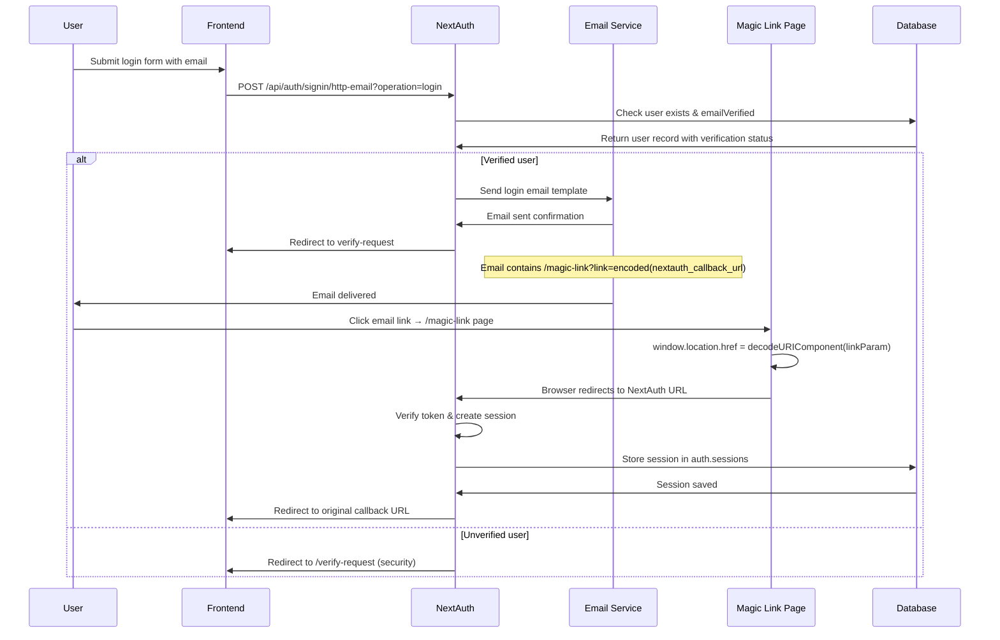

# Authentication System Documentation

## Overview

The AIID project uses **NextAuth.js** for authentication with a **passwordless email-based flow**. The system is deployed on Netlify using serverless functions and stores user data in MongoDB.

## Architecture

### Core Components
- **NextAuth.js** - Authentication library
- **MongoDB** - Two databases: `auth` (NextAuth data) and `customData` (user profiles/roles)
- **Netlify Functions** - Serverless authentication endpoint at `/api/auth/*`
- **React Context** - Frontend state management for user sessions

### Key Files
```
nextauth.config.ts           # NextAuth configuration
netlify/functions/auth.ts    # Serverless auth endpoint
src/contexts/UserContext.tsx # React context for user state
server/rules.ts             # GraphQL authorization rules
MongoDBAdapter.ts           # Custom MongoDB adapter (copied from @auth/mongodb-adapter for ESM compatibility)
```

## Authentication Flow

### 1. Magic Link Authentication
The system uses **passwordless authentication** with magic links:

1. **Frontend submits** email via POST to `/api/auth/signin/http-email`
2. **NextAuth queries** database to check if user exists
3. **Database returns** user record (or null for new users)
4. **NextAuth requests** email service to send appropriate template:
   - **New users**: "Signup" template
   - **Existing users**: "Login" template
5. **Email service confirms** email sent and **NextAuth redirects frontend** to verify-request page
6. **Email delivered** with link to `/magic-link?link=<encoded_nextauth_url>`
7. **User clicks** email link → goes to magic link interstitial page
8. **Magic link page** automatically redirects browser to actual NextAuth URL
9. **NextAuth verifies** token and creates user/session records
10. **Database confirms** record creation and **NextAuth redirects** to callback URL
11. **Links expire** after 24 hours

## Authentication Flow Diagrams

### Signup Flow



### Login Flow



### Magic Link Interstitial Page
The `/magic-link` interstitial page serves as a critical security layer. Instead of sending the NextAuth URL directly in emails, the system:

1. **Wraps the actual auth URL** in an interstitial page URL
2. **Protects against automated tools** like corporate email security scanners that automatically visit links
3. **Prevents token consumption** by security tools that would invalidate the magic link before the user clicks it
4. **Requires user interaction** to proceed to the actual authentication

### 2. Email Templates
- **Login** (existing users): "Secure link to log in to AIID"
- **Signup** (new users): "Secure link to create your AIID account"
- Both use `magicLink` variable and redirect through `/magic-link?link=<encoded_url>`

### 3. User Creation Flow
When a new user completes email verification:
1. **NextAuth verifies** the email token from magic link
2. **NextAuth creates** user record in `auth.users` collection
3. **Database confirms** user creation
4. **NextAuth creates** profile in `customData.users` with default role `['subscriber']`
5. **Database confirms** profile creation
6. **NextAuth redirects** frontend to `/account` page for profile completion

## Database Schema

**Auth Database (`auth`)**: `users`, `sessions`, `verification_tokens`

**Custom Data Database (`customData`)**: 
```typescript
users: {
  userId: string,        // Links to auth.users.id
  roles: string[],       // User roles array
  first_name?: string,
  last_name?: string,
  createdAt: Date
}
```

## User Roles & Permissions

### Available Roles
- `admin` - Full system access (overrides all other permissions)
- `subscriber` - Can subscribe to incidents, entities, reports
- `submitter` - Can submit incidents
- `incident_editor` - Can edit incidents
- `taxonomy_editor` - Can edit taxonomies
- `taxonomy_editor_{name}` - Can edit specific taxonomy

### Authorization Rules
GraphQL-level authorization using `graphql-shield`:
- **Role checks**: `isRole('admin')`, `isRole('subscriber')`
- **Ownership**: `isSelf()`, `isSubscriptionOwner()`, `isChecklistsOwner()`
- **Special**: `notQueriesAdminData()`, `hasHeaderSecret()`

## Session Management

### Configuration
```typescript
session: {
  maxAge: 5 * 24 * 60 * 60,    // 5 days
  updateAge: 24 * 60 * 60       // 24 hours
}
```

### Session Enrichment
The `session` callback enriches user data by:
1. Looking up user in `customData.users` by `userId`
2. Adding roles, first_name, last_name to session
3. Making this data available to frontend via `useSession()`

## Frontend Integration

```typescript
const { user, loading, isRole, isAdmin, actions } = useUserContext();

// Check roles
isRole('incident_editor')  // Role check
isAdmin                    // Admin check

// Authentication actions
actions.logIn(email, callbackUrl)
actions.signUp(email, callbackUrl)
actions.logOut()
```

## Security Features

### Anti-Enumeration Protection
The sign-in callback prevents email enumeration attacks:
- Unverified users attempting login are redirected to verify-request page
- Same flow for both verified and unverified emails
- No information leaked about email verification status

```typescript
// Custom signIn callback prevents unverified users from logging in
async signIn({ user }) {
  if (!(user as AdapterUser).emailVerified && req?.query?.operation == 'login') {
    // Gracefully stop signin while appearing successful (security)
    return config.SITE_URL + '/api/auth/verify-request?provider=http-email&type=email'
  }
  return true;
}
```

### Authorization Layers
1. **NextAuth Session** - Basic authentication
2. **GraphQL Shield** - Field-level authorization
3. **Role-based Access** - Granular permissions
4. **Ownership Validation** - Users can only access their own data

## Environment Variables

Required configuration:
```bash
NEXTAUTH_URL=https://incidentdatabase.ai
NEXTAUTH_SECRET=<jwt-signing-secret>
API_MONGODB_CONNECTION_STRING=<mongodb-connection>
MAILERSEND_API_KEY=<email-service-key>
SITE_URL=https://incidentdatabase.ai
```

## Authentication Pages
- `/login`, `/logout`, `/verify-request`, `/account`, `/auth-error`, `/magic-link`


## Usage Examples

### Checking Authentication Status

```typescript
import { useUserContext } from 'contexts/UserContext';

function MyComponent() {
  const { user, loading, isAdmin, isRole } = useUserContext();
  
  if (loading) return <Spinner />;
  if (!user) return <LoginPrompt />;
  
  return (
    <div>
      <p>Welcome, {user.first_name}!</p>
      {isAdmin && <AdminPanel />}
      {isRole('editor') && <EditButton />}
    </div>
  );
}
```


## Troubleshooting

1. **Email not received** - Check MAILERSEND_API_KEY configuration
2. **Session expired** - Sessions last 5 days, check session configuration  
3. **Role not recognized** - Verify role exists in `customData.users.roles` array
4. **GraphQL authorization error** - Check user roles match required permissions in `server/rules.ts`
5. **Magic Links Not Working** - Verify `NEXTAUTH_URL`, email service config, and MongoDB connection
6. **Session Not Persisting** - Check `NEXTAUTH_SECRET` and MongoDB session collection
7. **Role Permissions Not Working** - Verify role assignment in session callback