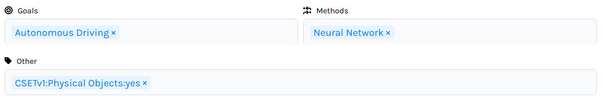
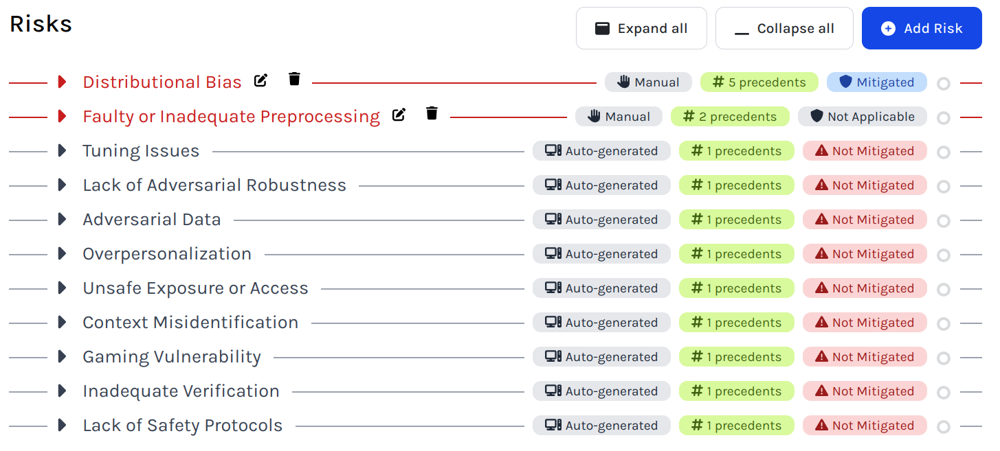

# Risk Checklists

The AI Incident Database provides 
for the creation of [*risk checklists*](
https://incidentdatabase.ai/apps/checklists/)
for use in auditing AI systems.
They contain user-applied taxonomic tags 
which describe the system under investigation.
These tags and are then used to query for risks associated
with incidents in the database to which the same tags are applied.
The pipeline is shown in the diagram below.

## Overview Diagram


## Tags

Tags are strings representing condensed values
from the `classifications` collection.
Classifications are applied to incidents and reports
by the editors of the AIID based on [taxonomies](
https://incidentdatabase.ai/taxonomies/).
They're stored in a somewhat verbose format – e.g.

```
{
  "_id": { "$oid": "688d2e67f60e92be4ce6a96a" },
  "namespace": "GMF",
  "publish": true,
  "notes": "",
  "attributes": [
    {
      "short_name": "Known AI Goal",
      "value_json": "[\"Question Answering\"]"
    },
	  {
      "short_name": "Known AI Technology",
      "value_json": "[\"Distributional Learning\",\"Language Modeling\"]"
    }
    ...
}
```

The incident associated with this class could be queried using any of the tags below.

- `GMF:Known AI Goal:Question Answering`
- `GMF:Known AI Technology:Distributional Learning`
- `GMF:Known AI Technology:Language Modeling`


## The GMF Taxonomy

The Risk Checklisting application centers 
the [Goals, Methods, and Failures taxonomy](
https://incidentdatabase.ai/taxonomy/gmf/).
This is because it provides a clear mapping 
of system attributes (goals and methods) to risks (failures).
For this reason, there are two tag inputs 
just for GMF goals and methods,
whereas all other taxonomies share the "other tags" field.



## Risks List

The list of risk includes "manual" (red)
and "auto-generated" (gray) risks.
Auto-generated risks are generated
based on the tags the user selects to describe a system.
Auto-generated risks change to manual
once the user has added an annotation to them
(risk status, severity, likelihood, notes).
Manual/Annotated risks are stored in the database,
whereas auto-generated risks are generated
when the user opens the checklist
or edits query tags.



## API

Risks are matched to tags with a specialized API query resolved in
`site/gatsby-site/server/fields/checklists.ts`.
For example:

```
query FindRisks {
  risks(input: {tags: ["GMF:Known AI Goal:Autonomous Driving"]}) {
    tags
    title
    precedents {
      incident_id
      title
      description
      tags
    }
  }
}
```

Response:
```
{
	"data": {
		"risks": [
			{
				"tags": [ "GMF:Known AI Technical Failure:Generalization Failure" ],
				"title": "Generalization Failure",
				"precedents": [
					{
						"incident_id": 221,
						"title": "A Road Engineer Killed Following a Collision Involving a Tesla on Autopilot",
						"description": "In Taiwan, a Tesla Model 3...",
						"tags": [
							"GMF:Potential AI Technology:Convolutional Neural Network",
							"GMF:Potential AI Technology:Visual Object Detection",
              ...
						],
						"__typename": "Precedents"
					},
					{
						"incident_id": 20,
						"title": "A Collection of Tesla Autopilot-Involved Crashes",
						"description": "Multiple unrelated car accidents...",
						"tags": [
							"GMF:Known AI Goal:Autonomous Driving",
							"GMF:Known AI Technology:Image Segmentation",
              ...
						],
						"__typename": "Precedents"
					},
          ...
				],
				"__typename": "Risks"
			},
			{
				"tags": [ "GMF:Known AI Technical Failure:Lack of Transparency" ],
				"title": "Lack of Transparency",
				"precedents": [
					{
						"incident_id": 175,
						"title": "Cruise Autonomous Taxi Allegedly Bolted off from Police After Being Pulled over in San Francisco",
						"description": "An autonomous Chevy Bolt...",
						"tags": [
							"GMF:Known AI Goal:Autonomous Driving",
							"GMF:Known AI Technology:Visual Object Detection",
              ...
						],
						"__typename": "Precedents"
					},
					{
						"incident_id": 187,
						"title": "YouTuber Tested Tesla on Self Driving Mode, Colliding with Street Pylons",
						"description": "A YouTuber who was a Tesla’s employee...",
						"tags": [
							"GMF:Known AI Goal:Autonomous Driving",
							"GMF:Known AI Technology:Convolutional Neural Network",
              ...
						],
						"__typename": "Precedents"
					},
          ...
				],
				"__typename": "Risks"
			},
      ...
		]
	}
}
```


## Checklist database entry fields

- `id` – `string` –
  A UUID for the checklist.

- `owner_id` – `string` –
  A string containing the user ID

- `name` – `string` – 
  A string containing the name or title of the checklist.
  This will often be the name of the system under investigation.

- `about` – `string` –
  A long text field describing the system under investigation 
  or the checklist itself.

- `tags_methods` – `string[]` –
  A list of GMF classification tags specifying the methods 
  used in the system under investigation.

- `tags_goals` – `string[]` – 
  A list of GMF classification tags 
  specifying the goals of the system under investigation.

- `tags_other` – `string[]` –
  A list of other classification tags 
  applicable to the system under investigation..

- `risks` – `object[]` –
  An array of objects representing **annotated** risks 
  identified for the system under investigation.
  These are distinct from the unannotated risks
  that appear as results generated from the tag fields above.
  The keys for its items are:

  - `id` – `string` –  A UUID for the risk.

  - `tags` – `string[]` –
    The GMF failure tag or tags defining this risk. 
    Used to match precedent incidents.

  - `title` – `string` –
    The title of the risk, usually the same as the tag name

  - `risk_status` – `'Not Mitigated' | 'Mitigated' | 'Prevented' | 'Not Applicable' | 'Unclear'` – 
    Annotation specifying the degree to which 
    the system is designed to mitigate 
    or prevent the risk in question.

  - `severity` – `string` –
    A free-text annotation for the severity of the risk.

  - `likelihood` – `string` – 
    A free-text annotation for the likelihood of the risk.

  - `risk_notes` – `string` – 
    A long, general-purpose free-text annotation.

  - `touched` – `boolean` – 
    An obsolete field once used 
    when unannotated risks were stored in the database.

