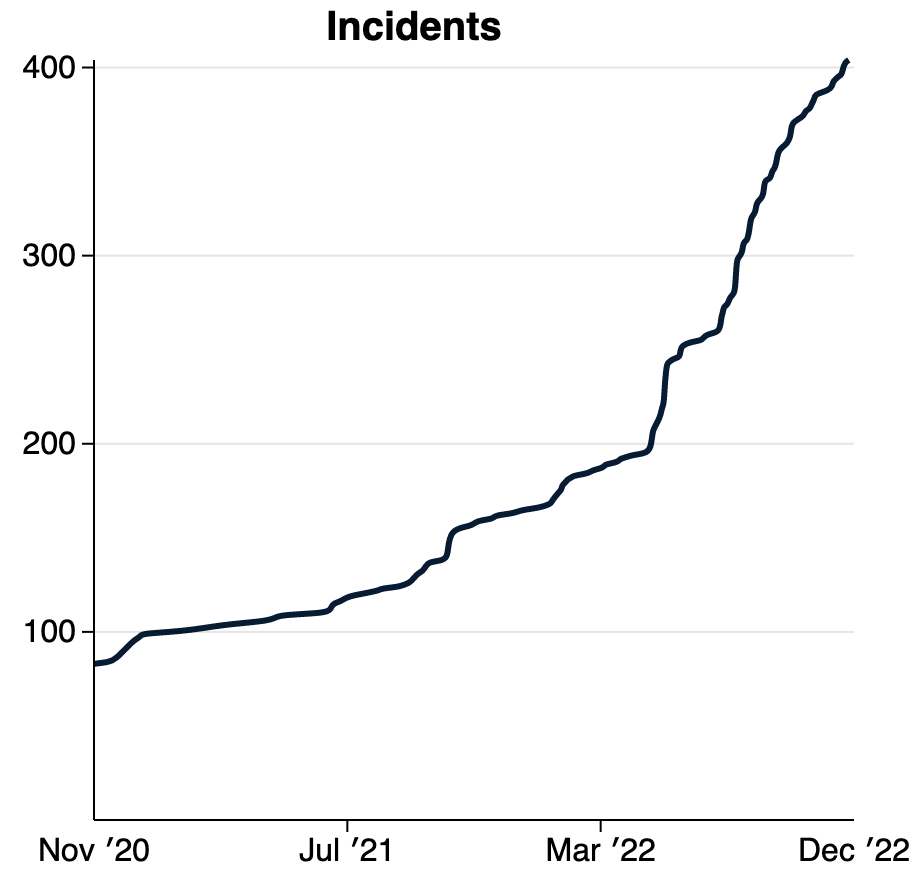

Dos años después de lanzar públicamente la base de datos de incidentes de IA (AIID) como una colección de daños o cuasi daños producidos por IA en el mundo, una acumulación de "[problemas](/apps/discover?display=details&is_incident_report=false&page=1)" **que no cumplen con sus criterios de ingestión de incidentes** acumulados en su cola de revisión. Para entender por qué, echemos un vistazo a la breve definición de **Incidente**.

> Definición de "incidente": *Un presunto daño o casi daño en el que está involucrado un sistema de IA.*

Esta definición es "evento", lo que significa que un riesgo debe materializarse en forma de daño. Pero, ¿qué pasa con los informes de riesgos que no necesariamente se han realizado (todavía)? En seguridad informática, los riesgos son "vulnerabilidades", mientras que un incidente de seguridad es una "exposición". Algunos análogos de IA incluyen:

<table>
    <tr>
        <td className='w-1/2 align-top'>
            
        </td>
        <td className='w-1/2 align-top'><a href="https://incidentdatabase.ai/reports/2304">"China desarrolla un 'fiscal' de IA para presentar cargos 'con un 97 % de precisión'"</a>
No es un incidente: el daño inevitable aún no ha ocurrido.
</td>
    </tr>
    <tr>
        <td className='w-1/2 align-top'><a href="https://incidentdatabase.ai/reports/2296">"IA y deepfakes presentan nuevos riesgos para las relaciones en Internet"</a>
No es un incidente: nos falta un ejemplo específico.
</td>
        <td className='w-1/2 align-top'>
            
        </td>
    </tr>
    <tr>
        <td className='w-1/2 align-top'>
            
        </td>
        <td className='w-1/2 align-top'><a href="https://incidentdatabase.ai/reports/2294">"Las ligeras modificaciones de los letreros de las calles pueden engañar por completo a los algoritmos de aprendizaje automático"</a>
No es un incidente: la vulnerabilidad aún no se ha explotado.
</td>
    </tr>
</table>

La comunidad de impactos de IA puede aprender, responder y evitar que muchos de estos problemas se conviertan en incidentes, pero requieren una definición formal y un criterio riguroso. Por lo tanto, introducimos "problemas" definidos como:

> Definición de "Problema": *Un presunto daño por parte de un sistema de IA que aún no se ha producido o detectado.*

Recientemente pusimos a disposición "informes de problemas" en la base de datos de incidentes de AI. Ahora puede buscar en la creciente lista de [problemas](/apps/discover?display=details%26is_incident_report=false%26page=1), que también están [traducidos automáticamente](/blog/multilingual-incident-reporting) al [español](/es/apps/discover?display=details%26is_incident_report=false%26page=1) y [inglés](/fr/apps/discover?display=details%26is_incident_report=false%26page=1). También puede buscar simultáneamente en incidentes y problemas para explorar riesgos emergentes y reales en el mundo.

Estas definiciones y su aplicación dentro de la base de datos de incidentes de IA están sujetas a una gran y creciente colección de reglas de edición[a] que adjudican decisiones difíciles. En la mayoría de los casos, la decisión de si algo es o no un incidente o problema depende de si alguien alega que cumple con los criterios más restrictivos. Nuestra intención al proponer estas definiciones es proporcionar un foro y una infraestructura para resolver estas cuestiones fundamentales.

<table>
    <tr>
        <td className='w-1/2 align-top'>
            

        </td>
        <td className='w-1/2 align-top'>
            Entre los foros más importantes para resolver estas preguntas se encuentra el <a href="https://oecd.ai/en/network-of-experts/working-group/1137">OECD.ai Working Group on Classification and Risk</a>, a través del cual la Colaboración Responsable de IA (la Colaboración) proporciona información sobre definiciones intergubernamentales emergentes para un marco de riesgo de IA de dos niveles similar al que se explora aquí.
        </td>
    </tr>
</table>

La adopción de definiciones compartidas para los riesgos de la IA es importante y oportuna.

<table>
    <tr>
        <td className='w-1/2 align-top'>
            Habiendo más que duplicado la cantidad de incidentes de IA indexados este año, estamos comenzando a ver un aumento en el ritmo de informes de incidentes. Con la llegada de la implementación de modelos generativos en el mundo real, esperamos que esta curva pronto se vuelva vertical. Planeamos abordar el ritmo acelerado de los incidentes mediante la introducción del concepto de "variante" en la base de datos de incidentes de IA.
        </td>
        <td className='w-1/2 align-top'>
            
        </td>
    </tr>
</table>

> Definición de "variante": un incidente que comparte los mismos factores causales, produce daños similares e involucra los mismos sistemas inteligentes que un incidente de IA conocido.

Una de las razones para introducir "variantes" en la base de datos de incidentes es reunir grandes conjuntos de datos de ejemplos en los que las entradas han producido daños. La mayoría de los sistemas de IA producen y actúan sobre datos, por lo que recopilar las circunstancias en las que los sistemas de IA funcionan mal es de suma importancia para garantizar que no vuelva a ocurrir. Los conjuntos de datos de impacto pueden llegar a definir las pruebas de seguridad en toda la industria, moviéndose así más allá de los procesos cualitativos hacia implementaciones de sistemas aseguradas cuantificablemente. Pronto [comenzaremos a indexar](https://github.com/responsible-ai-collaborative/aiid/issues/1283) texto generativo incorrecto antes de pasar a otros tipos de sistemas.

Finalmente, notamos nuestra posición privilegiada en el espacio del impacto social de la IA y deseamos señalar que el artículo de investigación publicado en el [Taller de NeurIPS sobre IA centrada en el ser humano](https://hcai-at-neurips.github.io/ site/ ) también detalla un identificador de incidente planificado para un mundo donde existen múltiples bases de datos de incidentes interrelacionados. Ninguna base de datos única puede indexar todos los incidentes y problemas de IA en el mundo, pero necesitamos desesperadamente asegurarnos de que todos los datos de incidentes se compartan. La base de datos de incidentes de IA [código base](https://github.com/responsible-ai-collaborative/aiid) se está moviendo para admitir la federación (es decir, el intercambio) de datos entre múltiples países, reguladores, idiomas y empresas. Comuníquese con (/contact) si desea obtener más información sobre los planes de la federación.

<table>
    <tr>
        <th colspan="2" className='w-full text-center'>
            <h5>Leer el artículo de investigación</h5>
            <h5>(Se expande en varios elementos)</h5>
        </th>
    </tr>
    <tr>
        <td colspan="2">
            McGregor, S., Paeth, K. y Lam, K. (2022). Indexación de riesgos de IA con incidentes, problemas y variantes. En Actas del [Taller de NeurIPS sobre IA centrada en humanos](https://hcai-at-neurips.github.io/site/) (NeurIPS-22). Conferencia Virtual.
        </td>
    </tr>
    <tr>
        <td className='w-1/2 align-top'>
            <strong>Resumen</strong>: <em>A pesar de no pasar los criterios actuales de la base de datos para incidentes, estos problemas mejoran la comprensión humana de dónde la IA presenta el potencial de daño. De manera similar a las bases de datos en aviación y seguridad informática, AIID propone adoptar un sistema de dos niveles para indexar incidentes de IA (es decir, un evento de daño o casi daño) y problemas (es decir, un evento de riesgo de daño). Además, dado que algunos sistemas basados ​​en aprendizaje automático a veces producen una gran cantidad de incidentes, se introduce la noción de "variante" de incidente. Estos cambios propuestos marcan la transición del AIID a una nueva versión en respuesta a las lecciones aprendidas de la edición de más de 2000 informes de incidentes e informes adicionales que se incluyen en la nueva categoría de "problema".</em> (<a href="https: //arxiv.org/abs/2211.10384">Leer más</a>)
        </td>
        <td className='w-1/2 align-top'>
            
        </td>
    </tr>
</table>

*Agradecimientos*: Kate Perkins brindó valiosos comentarios sobre el contenido del documento además de sus funciones como editora de incidentes de AIID. Las definiciones y discusiones presentadas en el documento también están muy influenciadas por los esfuerzos en curso de la Organización para la Cooperación y el Desarrollo Económicos (OCDE) para adoptar una definición compartida de incidente de IA en los 38 estados miembros. Finalmente, AIID es un esfuerzo de muchas personas y organizaciones organizadas bajo el lema de Responsible AI Collaborative, incluido el Center for Security and Emerging Technology (CSET), cuyo Zachary Arnold contribuyó a la definición y los criterios del primer incidente. Varias personas han contribuido a la implementación de las características de la base de datos, incluidos César Varela, Pablo Costa, Clara Youdale y Luna McNulty. Es a través de los esfuerzos colectivos de Collab que las perspectivas ontológicas presentadas anteriormente tienen significado e importancia en el mundo real.