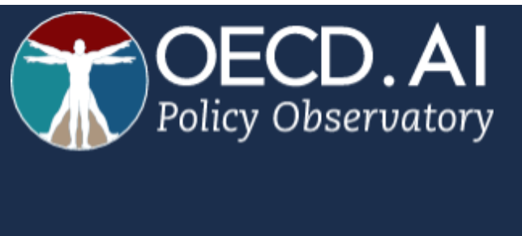
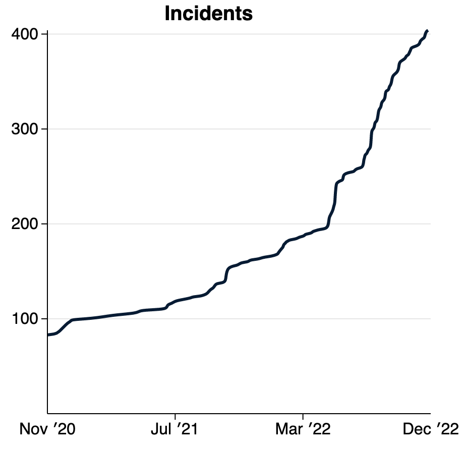
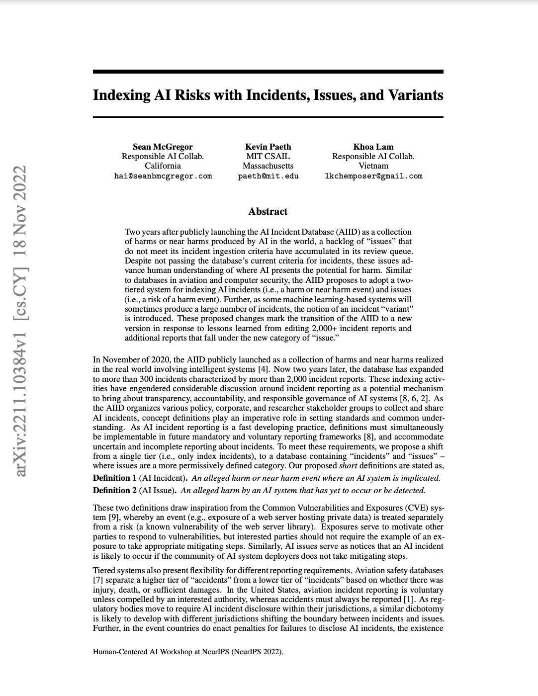

Deux ans après le lancement public de la base de données d'incidents d'IA (AIID) en tant que collection de dommages ou de quasi-dommages produits par l'IA dans le monde, un arriéré de "[issues](/apps/discover?display=details&is_incident_report=false&page=1)" **qui ne répondent pas à ses critères d'ingestion d'incidents** accumulés dans sa file d'attente de révision. Pour comprendre pourquoi, examinons la courte définition de l'**Incident**.

> Définition d'« incident » : *Un événement préjudiciable ou quasi-préjudiciable impliquant un système d'IA.*

Cette définition est "eventy", ce qui signifie qu'un risque doit être réalisé sous la forme d'un préjudice. Mais qu'en est-il des signalements de risques qui ne se sont pas nécessairement (encore) concrétisés ? En sécurité informatique, les risques sont des « vulnérabilités », tandis qu'un incident de sécurité est une « exposition ». Certains analogues de l'IA incluent :

<table>
    <tr>
        <td className='w-1/2 align-top'>
            
        </td>
        <td className='w-1/2 align-top'><a href="https://incidentdatabase.ai/reports/2304">"La Chine développe un "procureur" IA pour porter plainte "avec une précision de 97 %""</a>
Ce n'est pas un incident : l'inévitable événement dommageable ne s'est pas encore produit.
</td>
    </tr>
    <tr>
        <td className='w-1/2 align-top'><a href="https://incidentdatabase.ai/reports/2296">"L'IA et les deepfakes présentent de nouveaux risques pour les relations sur Internet"</a>
Pas un incident : il nous manque un exemple précis.
</td>
        <td className='w-1/2 align-top'>
            
        </td>
    </tr>
    <tr>
        <td className='w-1/2 align-top'>
            
        </td>
        <td className='w-1/2 align-top'><a href="https://incidentdatabase.ai/reports/2294">"De légères modifications des panneaux de signalisation peuvent complètement tromper les algorithmes d'apprentissage automatique"</a>
Il ne s'agit pas d'un incident : la vulnérabilité n'a pas encore été exploitée.
</td>
    </tr>
</table>

La communauté des impacts de l'IA peut apprendre, répondre et empêcher bon nombre de ces problèmes de se transformer en incidents, mais ils nécessitent une définition formelle et des critères rigoureux. Par conséquent, nous introduisons des "problèmes" définis comme :

> Définition du « problème » : *Un préjudice présumé causé par un système d'IA qui n'a pas encore eu lieu ou n'a pas encore été détecté.*

Nous avons récemment mis à disposition des "rapports de problèmes" dans la base de données des incidents d'IA. Vous pouvez désormais effectuer une recherche dans la liste croissante de [problèmes](/apps/discover?display=details%26is_incident_report=false%26page=1), qui sont également [traduits automatiquement](https ://incidentdatabase.ai/blog/multilingual-incident-reporting) en [espagnol](/es/apps/discover?display=details%26is_incident_report=false%26page=1) et [français](/fr/apps/discover?display=details%26is_incident_report=false%26page=1). Vous pouvez également rechercher simultanément des incidents et des problèmes pour explorer les risques émergents et réalisés dans le monde.

Ces définitions et leur application au sein de la base de données d'incidents d'IA sont soumises à un ensemble important et croissant de règles d'édition [a] qui statuent sur des décisions difficiles. Dans la plupart des cas, la décision de savoir si quelque chose est ou non un incident ou un problème dépend de la question de savoir si quelqu'un allègue que cela répond aux critères les plus restrictifs. Notre intention en proposant ces définitions est de fournir un forum et une infrastructure pour trier ces questions fondamentales.

<table>
    <tr>
        <td className='w-1/2 align-top'>
            

        </td>
        <td className='w-1/2 align-top'>
            Parmi les forums les plus importants pour trier ces questions figure le <a href="https://oecd.ai/en/network-of-experts/working-group/1137">OECD.ai Working Group on Classification and Risk< /a>, par le biais duquel le Responsible AI Collaborative (le Collab) fournit des commentaires sur les définitions intergouvernementales émergentes pour un cadre de risque d'IA à deux niveaux similaire à celui qui est exploré ici.
        </td>
    </tr>
</table>

L'adoption de définitions communes des risques liés à l'IA est à la fois importante et opportune.

<table>
    <tr>
        <td className='w-1/2 align-top'>
            Ayant plus que doublé le nombre d'incidents d'IA répertoriés cette année, nous commençons à constater une augmentation du rythme de signalement des incidents. Avec l'avènement du déploiement de modèles génératifs dans le monde réel, nous nous attendons à ce que cette courbe devienne bientôt verticale. Nous prévoyons de faire face à l'accélération du rythme des incidents en introduisant le concept de "variante" dans la base de données des incidents de l'IA.
        </td>
        <td className='w-1/2 align-top'>
            
        </td>
    </tr>
</table>
> Définition « variante » : un incident qui partage les mêmes facteurs de causalité, produit des dommages similaires et implique les mêmes systèmes intelligents qu'un incident d'IA connu.

L'une des raisons d'introduire des "variantes" dans la base de données des incidents est d'assembler de grands ensembles de données d'exemples où les entrées ont produit des dommages. La plupart des systèmes d'IA produisent et agissent sur des données, il est donc extrêmement important de collecter les circonstances dans lesquelles les systèmes d'IA fonctionnent mal pour s'assurer qu'elles ne se reproduisent pas. Les ensembles de données d'impact peuvent en venir à définir les tests de sécurité dans l'ensemble de l'industrie, allant ainsi au-delà des processus qualitatifs vers des déploiements de systèmes quantifiables. Nous allons bientôt [commencer l'indexation](https://github.com/responsible-ai-collaborative/aiid/issues/1283) du mauvais texte génératif avant de passer à d'autres types de systèmes.

Enfin, nous notons notre position privilégiée dans l'espace d'impact social de l'IA et souhaitons noter que le document de recherche publié dans le [NeurIPS Workshop on Human-Centered AI](https://hcai-at-neurips.github.io/ site/ ) détaille également un identifiant d'incident planifié pour un monde où il existe plusieurs bases de données d'incidents interdépendantes. Aucune base de données unique ne peut indexer tous les incidents et problèmes d'IA dans le monde, mais nous devons désespérément nous assurer que toutes les données d'incident sont partagées. La base de données d'incidents d'IA [codebase](https://github.com/responsible-ai-collaborative/aiid) évolue donc pour prendre en charge la fédération (c'est-à-dire le partage) de données entre plusieurs pays, régulateurs, langues et entreprises. Veuillez [contacter](/contact) si vous souhaitez plus d'informations sur les plans de fédération.

<table>
    <tr>
        <th colspan="2" className='w-full text-center'>
            <h5>Lire le document de recherche</h5>
            <h5>(Il se développe sur plusieurs éléments)</h5>
        </th>
    </tr>
    <tr>
        <td colspan="2">
            McGregor, S., Paeth, K. et Lam, K. (2022). Indexation des risques liés à l'IA avec des incidents, des problèmes et des variantes. Dans Actes du [NeurIPS Workshop on Human-Centered AI](https://hcai-at-neurips.github.io/site/) (NeurIPS-22). Conférence virtuelle.
        </td>
    </tr>
    <tr>
        <td className='w-1/2 align-top'>
           <strong>Résumé</strong> : <em>Bien qu'ils ne satisfassent pas aux critères actuels de la base de données pour les incidents, ces problèmes font progresser la compréhension humaine des endroits où l'IA présente un potentiel de préjudice. Semblable aux bases de données dans le domaine de l'aviation et de la sécurité informatique, l'AIID propose d'adopter un système à deux niveaux pour indexer les incidents d'IA (c'est-à-dire un événement dommageable ou presque) et les problèmes (c'est-à-dire un risque d'événement dommageable). De plus, comme certains systèmes basés sur l'apprentissage automatique produiront parfois un grand nombre d'incidents, la notion d'incident « variante » est introduite. Ces modifications proposées marquent la transition de l'AIID vers une nouvelle version en réponse aux enseignements tirés de la modification de plus de 2 000 rapports d'incidents et de rapports supplémentaires relevant de la nouvelle catégorie de "problème".</em> (<a href="https : //arxiv.org/abs/2211.10384">En savoir plus</a>)
        </td>
        <td className='w-1/2 align-top'>
            
        </td>
    </tr>
</table>

* Remerciements * : Kate Perkins a donné de précieux commentaires sur le contenu de l'article en plus de ses fonctions de rédactrice en chef des incidents AIID. Les définitions et les discussions présentées dans le document sont également fortement influencées par les efforts continus de l'Organisation de coopération et de développement économiques (OCDE) pour adopter une définition commune de l'incident d'IA dans les 38 États membres. Enfin, l'AIID est un effort de nombreuses personnes et organisations organisées sous la bannière du Responsible AI Collaborative, y compris le Center for Security and Emerging Technology (CSET), dont Zachary Arnold a contribué aux premiers critères et à la définition de l'incident. Plusieurs personnes ont contribué à la mise en œuvre des fonctionnalités de la base de données, notamment César Varela, Pablo Costa, Clara Youdale et Luna McNulty. C'est grâce aux efforts collectifs de la Collab que les perspectives ontologiques présentées ci-dessus ont un sens et une importance dans le monde réel.