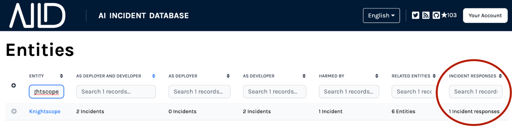

Bien conocida en la industria de la seguridad, una respuesta a incidentes es una forma estructurada para que las partes involucradas aprendan de los ataques y ayuden a la comunidad a protegerse de incidentes similares. La industria de la seguridad también ha establecido las mejores prácticas en torno a los incidentes de autoinforme para crear una base de conocimientos de las tácticas y técnicas adversarias basadas en observaciones del mundo real.

En inteligencia artificial, no ha habido un proceso análogo para los incidentes de IA. Sin una estructura para el manejo de incidentes o un mecanismo de autoinforme, las organizaciones y la sociedad en general no aprenden de los errores del pasado.

Para abordar esta necesidad, la base de datos de incidentes de IA ahora tiene un [formulario de respuesta a incidentes](/apps/submit/?tags=response) que llena el vacío en el autoinforme de las organizaciones involucradas en incidentes de IA.

La función más reciente alienta a las entidades directa o indirectamente involucradas en incidentes a enviar una Respuesta a incidentes. Esto permite que las entidades tengan voz en la discusión del incidente y brinden su perspectiva y análisis únicos.

Para dar crédito a las empresas que envían respuestas a incidentes por sus contribuciones a la seguridad y equidad de la IA, la base de datos de incidentes de IA integrará elementos en el sitio web que elogiarán a las empresas por sus buenas prácticas de gobierno del sistema.

Más allá de identificar incidentes de IA, las Respuestas a incidentes son el próximo paso crítico en la creación de una base de conocimientos de las mejores prácticas de seguridad de IA. Ayúdenos a prevenir de manera proactiva futuros daños y a promover la práctica ética y responsable de la IA.

Lea sobre la estructura de una respuesta a incidentes y ejemplos en "[Definir una respuesta a incidentes de IA](/research/5-response)".
