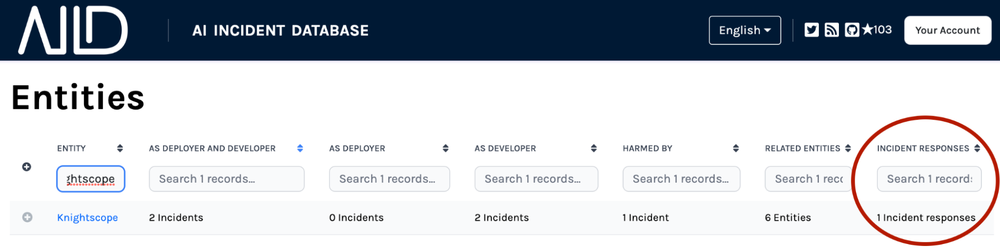

Well known in the security industry, an Incident Response is a structured way for involved parties to learn from attacks and help the community protect itself from similar incidents. The security industry has also established best practices around self-reporting incidents to build a knowledge base of adversary tactics and techniques based on real-world observations.

In artificial intelligence, there has been no such analogous process for AI incidents. Without a structure for handling incidents or a mechanism for self-reporting, organizations and society at large do not learn from past mistakes.

To address this need, the AI incident database now has an [Incident Response form](/apps/submit/?tags=response) that fills the gap in self-reporting by organizations involved in AI incidents.

The latest feature encourages entities directly or indirectly involved in incidents to submit an Incident Response. This allows entities to have a voice in the discussion of the incident and provide their unique perspective and analysis.

To give companies that submit incident responses credit for their contributions to AI safety and fairness, the AI Incident Database will be integrating elements to the website lauding companies for their good system governance practices.

Beyond identifying AI incidents, Incident Responses are a critical next step in building a knowledge base of AI safety best practices. Help us proactively prevent future harms and promote the ethical and responsible practice of AI.

Read about the structure of an Incident Response and examples at “[Defining an AI Incident Response](/research/5-response)”.
