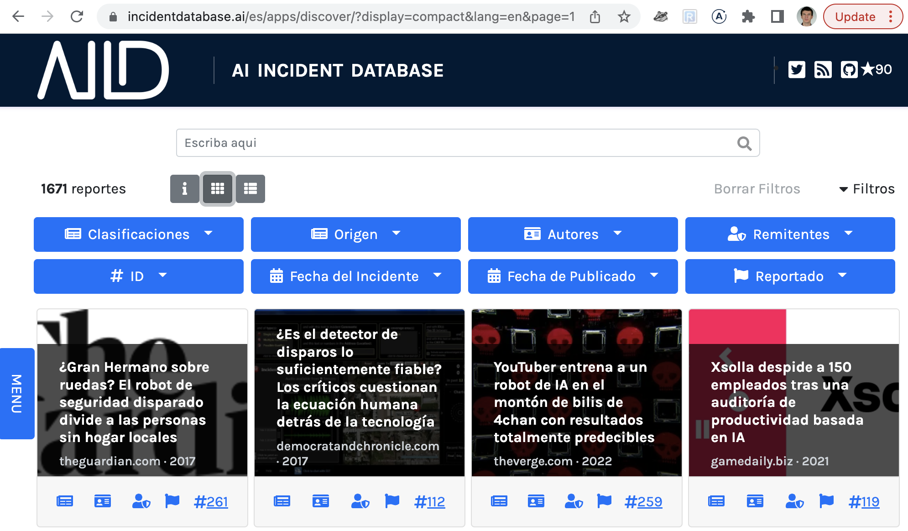

La recherche et le développement ont un **problème non résolu** majeur dans les systèmes d'IA de pointe: **faire en sorte que les systèmes fonctionnent bien au-delà de l'environnement pour lequel ils ont été conçus**. Bien que ce problème porte de nombreux noms (par exemple, changement de distribution, généralisation du modèle, robustesse des ensembles ouverts, etc.), ses implications sont déjà apparentes dans le monde réel,

<table>
  <tr>
   <td>

   </td>
   <td>

   </td>
  </tr>
  <tr>
   <td><a href="/cite/171">Incident 171</a>: un conducteur est condamné à une amende après avoir confondu le t-shirt d'une femme avec une plaque d'immatriculation. Le lecteur de plaque d'immatriculation n'est pas conçu pour différencier les chemises et les plaques d'immatriculation, il ne résout donc pas le problème de l'ensemble ouvert.
   </td>
   <td><a href="/cite/36">Incident 36</a>: Une femme est honteuse en Chine pour avoir fait du jaywalking parce que son image est sur le côté d'un bus. Le système de détection de personnes n'est pas conçu pour différencier les images de personnes des personnes réelles.
   </td>
  </tr>
</table>

Cette incapacité à "généraliser" est l'une des raisons pour lesquelles le partage d'incidents à travers les cultures, les géographies et les langues est si important: un système produit à l'origine dans un pays et déployé dans un autre produira des incidents imprévus dont le monde entier doit tirer des leçons. Par conséquent, **la base de données d'incidents d'IA a commencé à indexer les incidents d'IA dans toutes les langues.**

## Comment ça marche ?

La base de données d'incidents d'IA indexe les "rapports d'incidents" écrits, qui jusqu'à présent étaient entièrement en anglais. Désormais, lorsqu'un incident est signalé, le rapport est étiqueté avec une langue source et traduit automatiquement dans toutes les langues actuellement prises en charge.

| [Langues dans lesquelles nous acceptons les rapports](https://en.wikipedia.org/wiki/Google_Translate#Supported_languages)                                     | Languages Presented to Users                                                          |
| ------------------------------------------------------------------------------------------------------------------------------------------ | --------------------------------------------------------------------------------------|
| [Afrikaans](https://en.wikipedia.org/wiki/Afrikaans)                                                                                     | [English](https://incidentdatabase.ai) and [Spanish](https://incidentdatabase.ai/es/) |
| [Albanian](https://en.wikipedia.org/wiki/Albanian_language)                                                                              |                                                                                       |
| [Amharic](https://en.wikipedia.org/wiki/Amharic)                                                                                         |                                                                                       |
| [Arabic](https://en.wikipedia.org/wiki/Arabic)                                                                                           |                                                                                       |
| [Armenian](https://en.wikipedia.org/wiki/Armenian_language)                                                                              |                                                                                       |
| [Assamese](https://en.wikipedia.org/wiki/Assamese_language)                                                                              |                                                                                       |
| [Aymara](https://en.wikipedia.org/wiki/Aymara_language)                                                                                  |                                                                                       |
| [Azerbaijani](https://en.wikipedia.org/wiki/Azerbaijani_language)                                                                        |                                                                                       |
| [Bambara](https://en.wikipedia.org/wiki/Bambara_language)                                                                                |                                                                                       |
| [Basque](https://en.wikipedia.org/wiki/Basque_language)                                                                                  |                                                                                       |
| [Belarusian](https://en.wikipedia.org/wiki/Belarusian_language)                                                                          |                                                                                       |
| [Bengali](https://en.wikipedia.org/wiki/Bengali_language)                                                                                |                                                                                       |
| [Bhojpuri](https://en.wikipedia.org/wiki/Bhojpuri_language)                                                                              |                                                                                       |
| [Bosnian](https://en.wikipedia.org/wiki/Bosnian_language)                                                                                |                                                                                       |
| [Bulgarian](https://en.wikipedia.org/wiki/Bulgarian_language)                                                                            |                                                                                       |
| [Burmese](https://en.wikipedia.org/wiki/Burmese_language) (Myanmar)                                                                      |                                                                                       |
| [Catalan](https://en.wikipedia.org/wiki/Catalan_language)                                                                                |                                                                                       |
| [Cebuano](https://en.wikipedia.org/wiki/Cebuano_language)                                                                                |                                                                                       | 
| [Chewa](https://en.wikipedia.org/wiki/Chewa_language) (Chichewa)                                                                         |                                                                                       |
| [Chinese](https://en.wikipedia.org/wiki/Chinese_language) ([Simplified](https://en.wikipedia.org/wiki/Simplified_Chinese_characters))    |                                                                                       |
| [Chinese](https://en.wikipedia.org/wiki/Chinese_language) ([Traditional](https://en.wikipedia.org/wiki/Traditional_Chinese_characters))  |                                                                                       |
| [Corsican](https://en.wikipedia.org/wiki/Corsican_language)                                                                              |                                                                                       |
| [Croatian](https://en.wikipedia.org/wiki/Croatian_language)                                                                              |                                                                                       |
| [Czech](https://en.wikipedia.org/wiki/Czech_language)                                                                                    |                                                                                       |
| [Danish](https://en.wikipedia.org/wiki/Danish_language)                                                                                  |                                                                                       |
| [Dogri](https://en.wikipedia.org/wiki/Dogri_language)                                                                                    |                                                                                       |
| [Dutch](https://en.wikipedia.org/wiki/Dutch_language)                                                                                    |                                                                                       |
| [English](https://en.wikipedia.org/wiki/English_language)                                                                                |                                                                                       |
| [Esperanto](https://en.wikipedia.org/wiki/Esperanto)                                                                                     |                                                                                       |
| [Estonian](https://en.wikipedia.org/wiki/Estonian_language)                                                                              |                                                                                       |
| [Ewe](https://en.wikipedia.org/wiki/Ewe_language)                                                                                        |                                                                                       |
| [Finnish](https://en.wikipedia.org/wiki/Finnish_language)                                                                                |                                                                                       |
| [French](https://en.wikipedia.org/wiki/French_language)                                                                                  |                                                                                       |
| [Galician](https://en.wikipedia.org/wiki/Galician_language)                                                                              |                                                                                       |
| [Georgian](https://en.wikipedia.org/wiki/Georgian_language)                                                                              |                                                                                       |
| [German](https://en.wikipedia.org/wiki/German_language)                                                                                  |                                                                                       |
| [Greek](https://en.wikipedia.org/wiki/Greek_language)                                                                                    |                                                                                       |
| [Guarani](https://en.wikipedia.org/wiki/Guarani_language)                                                                                |                                                                                       |
| [Gujarati](https://en.wikipedia.org/wiki/Gujarati_language)                                                                              |                                                                                       |
| [Haitian Creole](https://en.wikipedia.org/wiki/Haitian_Creole)                                                                           |                                                                                       |
| [Hausa](https://en.wikipedia.org/wiki/Hausa_language)                                                                                    |                                                                                       |
| [Hawaiian](https://en.wikipedia.org/wiki/Hawaiian_language)                                                                              |                                                                                       |
| [Hebrew](https://en.wikipedia.org/wiki/Hebrew_language)                                                                                  |                                                                                       |
| [Hindi](https://en.wikipedia.org/wiki/Hindi)                                                                                             |                                                                                       |
| [Hmong](https://en.wikipedia.org/wiki/Hmong_language)                                                                                    |                                                                                       |
| [Hungarian](https://en.wikipedia.org/wiki/Hungarian_language)                                                                            |                                                                                       |
| [Icelandic](https://en.wikipedia.org/wiki/Icelandic_language)                                                                            |                                                                                       |
| [Igbo](https://en.wikipedia.org/wiki/Igbo_language)                                                                                      |                                                                                       |
| [Ilocano](https://en.wikipedia.org/wiki/Ilocano_language)                                                                                |                                                                                       |
| [Indonesian](https://en.wikipedia.org/wiki/Indonesian_language)                                                                          |                                                                                       |
| [Irish](https://en.wikipedia.org/wiki/Irish_language)                                                                                    |                                                                                       |
| [Italian](https://en.wikipedia.org/wiki/Italian_language)                                                                                |                                                                                       |
| [Japanese](https://en.wikipedia.org/wiki/Japanese_language)                                                                              |                                                                                       |
| [Javanese](https://en.wikipedia.org/wiki/Javanese_language)                                                                              |                                                                                       |
| [Kannada](https://en.wikipedia.org/wiki/Kannada)                                                                                         |                                                                                       |
| [Kazakh](https://en.wikipedia.org/wiki/Kazakh_language)                                                                                  |                                                                                       |
| [Khmer](https://en.wikipedia.org/wiki/Khmer_language)                                                                                    |                                                                                       |
| [Kinyarwanda](https://en.wikipedia.org/wiki/Kinyarwanda)                                                                                 |                                                                                       |
| [Konkani](https://en.wikipedia.org/wiki/Konkani_language)                                                                                |                                                                                       |
| [Korean](https://en.wikipedia.org/wiki/Korean_language)                                                                                  |                                                                                       |
| [Krio](https://en.wikipedia.org/wiki/Krio_language)                                                                                      |                                                                                       |
| [Kurdish](https://en.wikipedia.org/wiki/Kurdish_languages) ([Kurmanji](https://en.wikipedia.org/wiki/Kurmanji))                          |                                                                                       |
| [Kurdish](https://en.wikipedia.org/wiki/Kurdish_languages) ([Sorani](https://en.wikipedia.org/wiki/Sorani))                              |                                                                                       |
| [Kyrgyz](https://en.wikipedia.org/wiki/Kyrgyz_language)                                                                                  |                                                                                       |
| [Lao](https://en.wikipedia.org/wiki/Lao_language)                                                                                        |                                                                                       |
| [Latin](https://en.wikipedia.org/wiki/Latin)                                                                                             |                                                                                       |
| [Latvian](https://en.wikipedia.org/wiki/Latvian_language)                                                                                |                                                                                       |
| [Lingala](https://en.wikipedia.org/wiki/Lingala)                                                                                         |                                                                                       |
| [Lithuanian](https://en.wikipedia.org/wiki/Lithuanian_language)                                                                          |                                                                                       |
| [Luganda](https://en.wikipedia.org/wiki/Luganda)                                                                                         |                                                                                       |
| [Luxembourgish](https://en.wikipedia.org/wiki/Luxembourgish)                                                                             |                                                                                       |
| [Macedonian](https://en.wikipedia.org/wiki/Macedonian_language)                                                                          |                                                                                       |
| [Maithili](https://en.wikipedia.org/wiki/Maithili_language)                                                                              |                                                                                       |
| [Malagasy](https://en.wikipedia.org/wiki/Malagasy_language)                                                                              |                                                                                       |
| [Malay](https://en.wikipedia.org/wiki/Malay_language)                                                                                    |                                                                                       |
| [Malayalam](https://en.wikipedia.org/wiki/Malayalam)                                                                                     |                                                                                       |
| [Maldivian](https://en.wikipedia.org/wiki/Maldivian_language) (Dhivehi)                                                                  |                                                                                       |
| [Maltese](https://en.wikipedia.org/wiki/Maltese_language)                                                                                |                                                                                       |
| [Māori](https://en.wikipedia.org/wiki/M%C4%81ori_language) (Maori)                                                                       |                                                                                       |
| [Marathi](https://en.wikipedia.org/wiki/Marathi_language)                                                                                |                                                                                       |
| [Meitei](https://en.wikipedia.org/wiki/Meitei_language) (Manipuri, Meiteilon)                                                            |                                                                                       |
| [Mizo](https://en.wikipedia.org/wiki/Mizo_language)                                                                                      |                                                                                       |
| [Mongolian](https://en.wikipedia.org/wiki/Mongolian_language)                                                                            |                                                                                       |
| [Nepali](https://en.wikipedia.org/wiki/Nepali_language)                                                                                  |                                                                                       |
| [Northern Sotho](https://en.wikipedia.org/wiki/Northern_Sotho_language) (Sepedi)                                                         |                                                                                       |
| [Norwegian](https://en.wikipedia.org/wiki/Norwegian_language)                                                                            |                                                                                       |
| [Odia](https://en.wikipedia.org/wiki/Odia_language) (Oriya)                                                                              |                                                                                       |
| [Oromo](https://en.wikipedia.org/wiki/Oromo_language)                                                                                    |                                                                                       |
| [Pashto](https://en.wikipedia.org/wiki/Pashto)                                                                                           |                                                                                       |
| [Persian](https://en.wikipedia.org/wiki/Persian_language)                                                                                |                                                                                       |
| [Polish](https://en.wikipedia.org/wiki/Polish_language)                                                                                  |                                                                                       |
| [Portuguese](https://en.wikipedia.org/wiki/Portuguese_language)                                                                          |                                                                                       |
| [Punjabi](https://en.wikipedia.org/wiki/Punjabi_language)                                                                                |                                                                                       |
| [Quechua](https://en.wikipedia.org/wiki/Southern_Quechua)                                                                                |                                                                                       |
| [Romanian](https://en.wikipedia.org/wiki/Romanian_language)                                                                              |                                                                                       |
| [Russian](https://en.wikipedia.org/wiki/Russian_language)                                                                                |                                                                                       |
| [Samoan](https://en.wikipedia.org/wiki/Samoan_language)                                                                                  |                                                                                       |
| [Sanskrit](https://en.wikipedia.org/wiki/Sanskrit)                                                                                       |                                                                                       |
| [Scottish Gaelic](https://en.wikipedia.org/wiki/Scottish_Gaelic) (Scots Gaelic)                                                          |                                                                                       |
| [Serbian](https://en.wikipedia.org/wiki/Serbian_language)                                                                                |                                                                                       |
| [Sesotho](https://en.wikipedia.org/wiki/Sotho_language)                                                                                  |                                                                                       |
| [Shona](https://en.wikipedia.org/wiki/Shona_language)                                                                                    |                                                                                       |
| [Sindhi](https://en.wikipedia.org/wiki/Sindhi_language)                                                                                  |                                                                                       |
| [Sinhala](https://en.wikipedia.org/wiki/Sinhala_language)                                                                                |                                                                                       |
| [Slovak](https://en.wikipedia.org/wiki/Slovak_language)                                                                                  |                                                                                       |
| [Slovenian](https://en.wikipedia.org/wiki/Slovene_language)                                                                              |                                                                                       |
| [Somali](https://en.wikipedia.org/wiki/Somali_language)                                                                                  |                                                                                       |
| [Spanish](https://en.wikipedia.org/wiki/Spanish_language)                                                                                |                                                                                       |
| [Sundanese](https://en.wikipedia.org/wiki/Sundanese_language)                                                                            |                                                                                       |
| [Swahili](https://en.wikipedia.org/wiki/Swahili_language)                                                                                |                                                                                       |
| [Swedish](https://en.wikipedia.org/wiki/Swedish_language)                                                                                |                                                                                       |
| [Tagalog](https://en.wikipedia.org/wiki/Tagalog_language) ([Filipino](https://en.wikipedia.org/wiki/Filipino_language))                  |                                                                                       |
| [Tajik](https://en.wikipedia.org/wiki/Tajik_language)                                                                                    |                                                                                       |
| [Tamil](https://en.wikipedia.org/wiki/Tamil_language)                                                                                    |                                                                                       |
| [Tatar](https://en.wikipedia.org/wiki/Tatar_language)                                                                                    |                                                                                       |
| [Telugu](https://en.wikipedia.org/wiki/Telugu_language)                                                                                  |                                                                                       |
| [Thai](https://en.wikipedia.org/wiki/Thai_language)                                                                                      |                                                                                       |
| [Tigrinya](https://en.wikipedia.org/wiki/Tigrinya_language)                                                                              |                                                                                       |
| [Tsonga](https://en.wikipedia.org/wiki/Tsonga_language)                                                                                  |                                                                                       |
| [Turkish](https://en.wikipedia.org/wiki/Turkish_language)                                                                                |                                                                                       |
| [Turkmen](https://en.wikipedia.org/wiki/Turkmen_language)                                                                                |                                                                                       |
| [Twi](https://en.wikipedia.org/wiki/Twi)                                                                                                 |                                                                                       |
| [Ukrainian](https://en.wikipedia.org/wiki/Ukrainian_language)                                                                            |                                                                                       |
| [Urdu](https://en.wikipedia.org/wiki/Urdu)                                                                                               |                                                                                       |
| [Uyghur](https://en.wikipedia.org/wiki/Uyghur_language)                                                                                  |                                                                                       |
| [Uzbek](https://en.wikipedia.org/wiki/Uzbek_language)                                                                                    |                                                                                       |
| [Vietnamese](https://en.wikipedia.org/wiki/Vietnamese_language)                                                                          |                                                                                       |
| [Welsh](https://en.wikipedia.org/wiki/Welsh_language)                                                                                    |                                                                                       |
| [West Frisian](https://en.wikipedia.org/wiki/West_Frisian_language) (Frisian)                                                            |                                                                                       |
| [Xhosa](https://en.wikipedia.org/wiki/Xhosa_language)                                                                                    |                                                                                       |
| [Yiddish](https://en.wikipedia.org/wiki/Yiddish)                                                                                         |                                                                                       |
| [Yoruba](https://en.wikipedia.org/wiki/Yoruba_language)                                                                                  |                                                                                       |
| [Zulu](https://en.wikipedia.org/wiki/Zulu_language)                                                                                      |                                                                                       |

Pourquoi acceptons-nous 133 langues, mais ne fournissons-nous qu'une interface utilisateur pour trois langues ? **Opportunité et prudence.** Premièrement, la traduction de l'interface utilisateur (par exemple, les boutons, les descriptions, etc.) dans différentes langues prend du temps. Deuxièmement, la base de données d'incidents d'IA a de nombreux collaborateurs qui connaissent l'anglais et l'espagnol et peuvent corriger les mauvaises traductions. Bien que la traduction automatique prend en charge plus de 130 langues, nous pensons que les pires langues traduites ne sont pas suffisamment robustes pour être fiables. En fait, lors de nos tests de performances entre l'espagnol et l'anglais, nous avons trouvé que le texte résultant était interprétable, mais maladroit et incohérent. Les traductions sont bien adaptées aux fins de partage et de découverte d'incidents, mais ne sont pas de bonne qualité. Au fur et à mesure que nous gagnons confiance dans la qualité de la traduction automatique des langues à faibles ressources et/ou élargissons notre communauté de collaborateurs, **nous ajouterons des langues à l'interface utilisateur de la base de données**. Nous prévoyons d'ajouter le support en français au cours du mois prochain.

En bref: la voie la plus rapide et la plus prudente consiste à ajouter une seule langue avant de mettre à l'échelle la fonctionnalité. Vous pouvez nous aider à accélérer nos projets d'indexation de toutes les langues, de l'albanais au zoulou.

## Appel à l'action

Nous avons fondé la Responsible AI Collaborative (l'organisation qui régit la base de données d'incidents d'IA) pour développer en collaboration les systèmes nécessaires au partage des incidents entre les cultures, les langues et les zones géographiques. Nous **_avons besoin de votre aide_** pour nous assurer que nos traductions servent la théorie du changement de la Incident Database. Veuillez [nous contacter](/contact) si vous souhaitez aider à traduire des langues autres que l'anglais !

## Addendum : Risques liés au modèle et meilleures pratiques

> Avertissement : nous donnons ici un exemple d'erreur de traduction pour illustrer comment la traduction automatique **produira inévitablement des incidents liés à l'IA**. L'incident en question est offensant et insultant.

La traduction automatique est un cas illustratif idéal pour expliquer pourquoi la collecte et la diffusion des incidents d'IA sont si importantes. Peu de gens diraient que le monde serait mieux sans traduction automatique, mais la technologie produit régulièrement des incidents offensants et [parfois dangereux](/cite/72).

> _Un navire au port est sûr, mais ce n'est pas pour cela que les navires sont construits._

Pour prolonger un aphorisme sur la sécurité des navires, il existe une variété de technologies de soutien (satellites météo, radar, etc.) et de processus (fermez les écoutes !) déterminant comment et s'il est approprié de mettre les voiles. Les entreprises, y compris la Responsible AI Collaborative, doivent mettre en place des systèmes et des processus pour la surveillance, l'amélioration et le signalement des incidents.

Revenant au contexte de la traduction automatique, le défi non résolu de la généralisation est celui du contexte et du sous-texte. Les humains ont un "modèle" pour leur public qui leur permet de communiquer plus que la traduction littérale du texte. La résolution de ce sous-texte est souvent l'endroit où la traduction automatique tourne mal. Par exemple, un contributeur de la base de données d'incidents a récemment partagé cette image de la fonctionnalité de traduction basée sur l'appareil photo de Google sur Google Lens,

<SensitiveImage contentWarning="Cliquer pour voir l'image choquante">

 
 
</SensitiveImage>

Il s'agit d'une traduction qui ne devrait jamais être produite dans le contexte d'un livre concernant le premier ministre de la culture en Corée. Cependant, en discutant avec des lecteurs de la langue coréenne, vous pouvez voir comment une traduction sans contexte qui est probablement entrainée avec les communications Internet pourrait arriver à cette traduction.

Le titre du livre se traduit littéralement par "ça, ça", ce qui signifie aussi "sur le bout de ma langue". Combinez cela avec l'utilisation coréenne de "ça" comme argot pour les organes génitaux masculins, et vous arrivez à cette malheureuse erreur de traduction. Sans le contexte que le texte traduit est le titre d'un livre d'une personne sérieuse, la traduction la plus probable (et la plus choquante) est celle que l'on trouverait sur les messages électroniques.

**_Pouvons-nous éviter d'ajouter la base de données d'incidents d'IA en tant qu'incident dans la base de données des incidents AI ?_**

Non. Mais **_nous pouvons réduire la probabilité et les impacts négatifs._** À cet égard, les meilleures pratiques que nous avons identifiées sont : (1) toujours identifier dans l'interface utilisateur lorsque le contenu a été traduit automatiquement, (2) fournir un lien vers le texte source non traduit, (3) fournir la possibilité aux personnes de signaler, corriger et améliorer les mauvaises traductions, (4) valider l'efficacité des traductions entre les langues avant de rendre ces traductions généralement disponibles, et (5) développer une communauté de personnes qui peut interpréter et répondre aux problèmes de traduction s'ils surviennent.