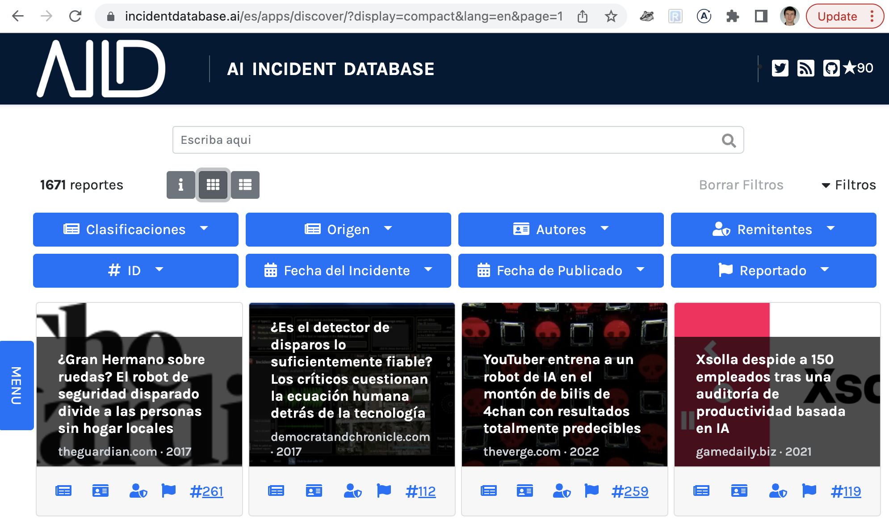

Research and development has a major **unsolved problem** throughout state of the art AI systems: **making systems perform well beyond the environment for which they were engineered**. While this problem goes by many names (e.g., distributional shift, model generalization, open set robustness, etc.), its implications are already apparent in the real world,

<table>
  <tr>
   <td>

   </td>
   <td>

   </td>
  </tr>
  <tr>
   <td><a href="/cite/171">Incident 171</a>: A driver is fined after a woman's t-shirt is mistaken for a license plate. The license plate reader is not engineered to differentiate shirts and license plates so it does not solve the open set problem.
   </td>
   <td><a href="/cite/36">Incident 36</a>: A woman is shamed in china for jaywalking because her image is on the side of a bus. The person detection system is not engineered to differentiate images of people from actual people.
   </td>
  </tr>
</table>

This incapacity to "generalize" is among the reasons why sharing incidents across cultures, geographies, and languages is so critically important: a system originally produced in one country and deployed in another will produce unforeseen incidents that the whole world needs to learn from. Therefore, **the AI Incident Database has begun indexing AI incidents across languages.**

 

## How Does this Work?

The AI Incident Database indexes written "incident reports," which until now have entirely been in English. Now, when an incident is reported, the report is tagged with a source language and machine translated to all languages that are currently in support.

| [Languages We Accept Reports From](https://en.wikipedia.org/wiki/Google_Translate#Supported_languages)                                     | Languages Presented to Users                                                          |
| ------------------------------------------------------------------------------------------------------------------------------------------ | --------------------------------------------------------------------------------------|
| [Afrikaans](https://en.wikipedia.org/wiki/Afrikaans)                                                                                     | [English](https://incidentdatabase.ai) and [Spanish](https://incidentdatabase.ai/es/) |
| [Albanian](https://en.wikipedia.org/wiki/Albanian_language)                                                                              |                                                                                       |
| [Amharic](https://en.wikipedia.org/wiki/Amharic)                                                                                         |                                                                                       |
| [Arabic](https://en.wikipedia.org/wiki/Arabic)                                                                                           |                                                                                       |
| [Armenian](https://en.wikipedia.org/wiki/Armenian_language)                                                                              |                                                                                       |
| [Assamese](https://en.wikipedia.org/wiki/Assamese_language)                                                                              |                                                                                       |
| [Aymara](https://en.wikipedia.org/wiki/Aymara_language)                                                                                  |                                                                                       |
| [Azerbaijani](https://en.wikipedia.org/wiki/Azerbaijani_language)                                                                        |                                                                                       |
| [Bambara](https://en.wikipedia.org/wiki/Bambara_language)                                                                                |                                                                                       |
| [Basque](https://en.wikipedia.org/wiki/Basque_language)                                                                                  |                                                                                       |
| [Belarusian](https://en.wikipedia.org/wiki/Belarusian_language)                                                                          |                                                                                       |
| [Bengali](https://en.wikipedia.org/wiki/Bengali_language)                                                                                |                                                                                       |
| [Bhojpuri](https://en.wikipedia.org/wiki/Bhojpuri_language)                                                                              |                                                                                       |
| [Bosnian](https://en.wikipedia.org/wiki/Bosnian_language)                                                                                |                                                                                       |
| [Bulgarian](https://en.wikipedia.org/wiki/Bulgarian_language)                                                                            |                                                                                       |
| [Burmese](https://en.wikipedia.org/wiki/Burmese_language) (Myanmar)                                                                      |                                                                                       |
| [Catalan](https://en.wikipedia.org/wiki/Catalan_language)                                                                                |                                                                                       |
| [Cebuano](https://en.wikipedia.org/wiki/Cebuano_language)                                                                                |                                                                                       | 
| [Chewa](https://en.wikipedia.org/wiki/Chewa_language) (Chichewa)                                                                         |                                                                                       |
| [Chinese](https://en.wikipedia.org/wiki/Chinese_language) ([Simplified](https://en.wikipedia.org/wiki/Simplified_Chinese_characters))    |                                                                                       |
| [Chinese](https://en.wikipedia.org/wiki/Chinese_language) ([Traditional](https://en.wikipedia.org/wiki/Traditional_Chinese_characters))  |                                                                                       |
| [Corsican](https://en.wikipedia.org/wiki/Corsican_language)                                                                              |                                                                                       |
| [Croatian](https://en.wikipedia.org/wiki/Croatian_language)                                                                              |                                                                                       |
| [Czech](https://en.wikipedia.org/wiki/Czech_language)                                                                                    |                                                                                       |
| [Danish](https://en.wikipedia.org/wiki/Danish_language)                                                                                  |                                                                                       |
| [Dogri](https://en.wikipedia.org/wiki/Dogri_language)                                                                                    |                                                                                       |
| [Dutch](https://en.wikipedia.org/wiki/Dutch_language)                                                                                    |                                                                                       |
| [English](https://en.wikipedia.org/wiki/English_language)                                                                                |                                                                                       |
| [Esperanto](https://en.wikipedia.org/wiki/Esperanto)                                                                                     |                                                                                       |
| [Estonian](https://en.wikipedia.org/wiki/Estonian_language)                                                                              |                                                                                       |
| [Ewe](https://en.wikipedia.org/wiki/Ewe_language)                                                                                        |                                                                                       |
| [Finnish](https://en.wikipedia.org/wiki/Finnish_language)                                                                                |                                                                                       |
| [French](https://en.wikipedia.org/wiki/French_language)                                                                                  |                                                                                       |
| [Galician](https://en.wikipedia.org/wiki/Galician_language)                                                                              |                                                                                       |
| [Georgian](https://en.wikipedia.org/wiki/Georgian_language)                                                                              |                                                                                       |
| [German](https://en.wikipedia.org/wiki/German_language)                                                                                  |                                                                                       |
| [Greek](https://en.wikipedia.org/wiki/Greek_language)                                                                                    |                                                                                       |
| [Guarani](https://en.wikipedia.org/wiki/Guarani_language)                                                                                |                                                                                       |
| [Gujarati](https://en.wikipedia.org/wiki/Gujarati_language)                                                                              |                                                                                       |
| [Haitian Creole](https://en.wikipedia.org/wiki/Haitian_Creole)                                                                           |                                                                                       |
| [Hausa](https://en.wikipedia.org/wiki/Hausa_language)                                                                                    |                                                                                       |
| [Hawaiian](https://en.wikipedia.org/wiki/Hawaiian_language)                                                                              |                                                                                       |
| [Hebrew](https://en.wikipedia.org/wiki/Hebrew_language)                                                                                  |                                                                                       |
| [Hindi](https://en.wikipedia.org/wiki/Hindi)                                                                                             |                                                                                       |
| [Hmong](https://en.wikipedia.org/wiki/Hmong_language)                                                                                    |                                                                                       |
| [Hungarian](https://en.wikipedia.org/wiki/Hungarian_language)                                                                            |                                                                                       |
| [Icelandic](https://en.wikipedia.org/wiki/Icelandic_language)                                                                            |                                                                                       |
| [Igbo](https://en.wikipedia.org/wiki/Igbo_language)                                                                                      |                                                                                       |
| [Ilocano](https://en.wikipedia.org/wiki/Ilocano_language)                                                                                |                                                                                       |
| [Indonesian](https://en.wikipedia.org/wiki/Indonesian_language)                                                                          |                                                                                       |
| [Irish](https://en.wikipedia.org/wiki/Irish_language)                                                                                    |                                                                                       |
| [Italian](https://en.wikipedia.org/wiki/Italian_language)                                                                                |                                                                                       |
| [Japanese](https://en.wikipedia.org/wiki/Japanese_language)                                                                              |                                                                                       |
| [Javanese](https://en.wikipedia.org/wiki/Javanese_language)                                                                              |                                                                                       |
| [Kannada](https://en.wikipedia.org/wiki/Kannada)                                                                                         |                                                                                       |
| [Kazakh](https://en.wikipedia.org/wiki/Kazakh_language)                                                                                  |                                                                                       |
| [Khmer](https://en.wikipedia.org/wiki/Khmer_language)                                                                                    |                                                                                       |
| [Kinyarwanda](https://en.wikipedia.org/wiki/Kinyarwanda)                                                                                 |                                                                                       |
| [Konkani](https://en.wikipedia.org/wiki/Konkani_language)                                                                                |                                                                                       |
| [Korean](https://en.wikipedia.org/wiki/Korean_language)                                                                                  |                                                                                       |
| [Krio](https://en.wikipedia.org/wiki/Krio_language)                                                                                      |                                                                                       |
| [Kurdish](https://en.wikipedia.org/wiki/Kurdish_languages) ([Kurmanji](https://en.wikipedia.org/wiki/Kurmanji))                          |                                                                                       |
| [Kurdish](https://en.wikipedia.org/wiki/Kurdish_languages) ([Sorani](https://en.wikipedia.org/wiki/Sorani))                              |                                                                                       |
| [Kyrgyz](https://en.wikipedia.org/wiki/Kyrgyz_language)                                                                                  |                                                                                       |
| [Lao](https://en.wikipedia.org/wiki/Lao_language)                                                                                        |                                                                                       |
| [Latin](https://en.wikipedia.org/wiki/Latin)                                                                                             |                                                                                       |
| [Latvian](https://en.wikipedia.org/wiki/Latvian_language)                                                                                |                                                                                       |
| [Lingala](https://en.wikipedia.org/wiki/Lingala)                                                                                         |                                                                                       |
| [Lithuanian](https://en.wikipedia.org/wiki/Lithuanian_language)                                                                          |                                                                                       |
| [Luganda](https://en.wikipedia.org/wiki/Luganda)                                                                                         |                                                                                       |
| [Luxembourgish](https://en.wikipedia.org/wiki/Luxembourgish)                                                                             |                                                                                       |
| [Macedonian](https://en.wikipedia.org/wiki/Macedonian_language)                                                                          |                                                                                       |
| [Maithili](https://en.wikipedia.org/wiki/Maithili_language)                                                                              |                                                                                       |
| [Malagasy](https://en.wikipedia.org/wiki/Malagasy_language)                                                                              |                                                                                       |
| [Malay](https://en.wikipedia.org/wiki/Malay_language)                                                                                    |                                                                                       |
| [Malayalam](https://en.wikipedia.org/wiki/Malayalam)                                                                                     |                                                                                       |
| [Maldivian](https://en.wikipedia.org/wiki/Maldivian_language) (Dhivehi)                                                                  |                                                                                       |
| [Maltese](https://en.wikipedia.org/wiki/Maltese_language)                                                                                |                                                                                       |
| [Māori](https://en.wikipedia.org/wiki/M%C4%81ori_language) (Maori)                                                                       |                                                                                       |
| [Marathi](https://en.wikipedia.org/wiki/Marathi_language)                                                                                |                                                                                       |
| [Meitei](https://en.wikipedia.org/wiki/Meitei_language) (Manipuri, Meiteilon)                                                            |                                                                                       |
| [Mizo](https://en.wikipedia.org/wiki/Mizo_language)                                                                                      |                                                                                       |
| [Mongolian](https://en.wikipedia.org/wiki/Mongolian_language)                                                                            |                                                                                       |
| [Nepali](https://en.wikipedia.org/wiki/Nepali_language)                                                                                  |                                                                                       |
| [Northern Sotho](https://en.wikipedia.org/wiki/Northern_Sotho_language) (Sepedi)                                                         |                                                                                       |
| [Norwegian](https://en.wikipedia.org/wiki/Norwegian_language)                                                                            |                                                                                       |
| [Odia](https://en.wikipedia.org/wiki/Odia_language) (Oriya)                                                                              |                                                                                       |
| [Oromo](https://en.wikipedia.org/wiki/Oromo_language)                                                                                    |                                                                                       |
| [Pashto](https://en.wikipedia.org/wiki/Pashto)                                                                                           |                                                                                       |
| [Persian](https://en.wikipedia.org/wiki/Persian_language)                                                                                |                                                                                       |
| [Polish](https://en.wikipedia.org/wiki/Polish_language)                                                                                  |                                                                                       |
| [Portuguese](https://en.wikipedia.org/wiki/Portuguese_language)                                                                          |                                                                                       |
| [Punjabi](https://en.wikipedia.org/wiki/Punjabi_language)                                                                                |                                                                                       |
| [Quechua](https://en.wikipedia.org/wiki/Southern_Quechua)                                                                                |                                                                                       |
| [Romanian](https://en.wikipedia.org/wiki/Romanian_language)                                                                              |                                                                                       |
| [Russian](https://en.wikipedia.org/wiki/Russian_language)                                                                                |                                                                                       |
| [Samoan](https://en.wikipedia.org/wiki/Samoan_language)                                                                                  |                                                                                       |
| [Sanskrit](https://en.wikipedia.org/wiki/Sanskrit)                                                                                       |                                                                                       |
| [Scottish Gaelic](https://en.wikipedia.org/wiki/Scottish_Gaelic) (Scots Gaelic)                                                          |                                                                                       |
| [Serbian](https://en.wikipedia.org/wiki/Serbian_language)                                                                                |                                                                                       |
| [Sesotho](https://en.wikipedia.org/wiki/Sotho_language)                                                                                  |                                                                                       |
| [Shona](https://en.wikipedia.org/wiki/Shona_language)                                                                                    |                                                                                       |
| [Sindhi](https://en.wikipedia.org/wiki/Sindhi_language)                                                                                  |                                                                                       |
| [Sinhala](https://en.wikipedia.org/wiki/Sinhala_language)                                                                                |                                                                                       |
| [Slovak](https://en.wikipedia.org/wiki/Slovak_language)                                                                                  |                                                                                       |
| [Slovenian](https://en.wikipedia.org/wiki/Slovene_language)                                                                              |                                                                                       |
| [Somali](https://en.wikipedia.org/wiki/Somali_language)                                                                                  |                                                                                       |
| [Spanish](https://en.wikipedia.org/wiki/Spanish_language)                                                                                |                                                                                       |
| [Sundanese](https://en.wikipedia.org/wiki/Sundanese_language)                                                                            |                                                                                       |
| [Swahili](https://en.wikipedia.org/wiki/Swahili_language)                                                                                |                                                                                       |
| [Swedish](https://en.wikipedia.org/wiki/Swedish_language)                                                                                |                                                                                       |
| [Tagalog](https://en.wikipedia.org/wiki/Tagalog_language) ([Filipino](https://en.wikipedia.org/wiki/Filipino_language))                  |                                                                                       |
| [Tajik](https://en.wikipedia.org/wiki/Tajik_language)                                                                                    |                                                                                       |
| [Tamil](https://en.wikipedia.org/wiki/Tamil_language)                                                                                    |                                                                                       |
| [Tatar](https://en.wikipedia.org/wiki/Tatar_language)                                                                                    |                                                                                       |
| [Telugu](https://en.wikipedia.org/wiki/Telugu_language)                                                                                  |                                                                                       |
| [Thai](https://en.wikipedia.org/wiki/Thai_language)                                                                                      |                                                                                       |
| [Tigrinya](https://en.wikipedia.org/wiki/Tigrinya_language)                                                                              |                                                                                       |
| [Tsonga](https://en.wikipedia.org/wiki/Tsonga_language)                                                                                  |                                                                                       |
| [Turkish](https://en.wikipedia.org/wiki/Turkish_language)                                                                                |                                                                                       |
| [Turkmen](https://en.wikipedia.org/wiki/Turkmen_language)                                                                                |                                                                                       |
| [Twi](https://en.wikipedia.org/wiki/Twi)                                                                                                 |                                                                                       |
| [Ukrainian](https://en.wikipedia.org/wiki/Ukrainian_language)                                                                            |                                                                                       |
| [Urdu](https://en.wikipedia.org/wiki/Urdu)                                                                                               |                                                                                       |
| [Uyghur](https://en.wikipedia.org/wiki/Uyghur_language)                                                                                  |                                                                                       |
| [Uzbek](https://en.wikipedia.org/wiki/Uzbek_language)                                                                                    |                                                                                       |
| [Vietnamese](https://en.wikipedia.org/wiki/Vietnamese_language)                                                                          |                                                                                       |
| [Welsh](https://en.wikipedia.org/wiki/Welsh_language)                                                                                    |                                                                                       |
| [West Frisian](https://en.wikipedia.org/wiki/West_Frisian_language) (Frisian)                                                            |                                                                                       |
| [Xhosa](https://en.wikipedia.org/wiki/Xhosa_language)                                                                                    |                                                                                       |
| [Yiddish](https://en.wikipedia.org/wiki/Yiddish)                                                                                         |                                                                                       |
| [Yoruba](https://en.wikipedia.org/wiki/Yoruba_language)                                                                                  |                                                                                       |
| [Zulu](https://en.wikipedia.org/wiki/Zulu_language)                                                                                      |                                                                                       |

Why are we accepting 133 languages, but only providing a user interface for two languages? **Expediency and caution.** First, translating the user interface (e.g., buttons, descriptions, etc.) to different languages takes time. Second, the AI Incident Database has many collaborators that know English and Spanish and can fix bad translations. While machine translation does support 130+ languages, we don't believe the worst translated languages among these are sufficiently robust to be relied upon. In fact, in our testing of performance between Spanish and English, we found the resulting text to be interpretable, but awkward and inconsistent. The translations are a good fit for the purpose of incident sharing and discovery, but are not good writing. As we gain confidence in the quality of machine translation of low-resource languages and/or expand our community of collaborators, **we will add languages to the database user interface**. We expect to add French support within the next month.

In short: the most expedient and cautious path forward is to add a single language before scaling the feature. You can help accelerate our plans to index in everything from Albanian to Zulu.

## Call to Action

We founded the Responsible AI Collaborative (the organization governing the AI Incident Database) to collaboratively develop the systems necessary to share incidents across cultures, languages, and geographies. We **_need your help_** to ensure our translations serve the Incident Database's theory of change. Please [contact us](/contact) if you are eager to help translate and localize non-English languages!

## Addendum: Model Risks and Best Practices

> Warning: here we give an example of a mistranslation to illustrate how machine translation **will inevitably produce AI incidents**. The incident in question is offensive and insulting.

Machine translation is an ideal illustrative case for why the collection and dissemination of AI incidents is so important. Few would argue the world would be better off without machine translation, but the technology regularly produces offensive and [sometimes dangerous incidents](/cite/72). 

> _A ship in harbor is safe, but that is not what ships are built for._

To extend an aphorism on the safety of ships, there is a variety of supporting technologies (weather satellites, radar, etc.) and processes (batten down the hatches!) determining how and whether it is appropriate to set sail. Companies, including the Responsible AI Collaborative, must build systems and processes for model monitoring, improvement, and incident reporting.

Stepping back to the context of machine translation, the unsolved generalization challenge is one of context and subtext. Humans have a "model" for their audience that allows them to communicate more than the literal translation of the text. Solving for this subtext is often where machine translation goes wrong. For example, an Incident Database contributor recently shared this image from Google's camera-based translation feature on Google Lens,

<SensitiveImage contentWarning="Click to view offensive image">

  

</SensitiveImage>

This is a translation that should never be produced in the context of a book from the first minister of culture in Korea. However, in discussion with readers of the Korean language, you can see how a no-context translation that is likely trained on internet communications could arrive at this translation.

The title of the book literally translates as "that, that," which also means "on the tip of my tongue." Combine this with the Korean usage of "that" as slang for male genitalia, and you arrive at this unfortunate mistranslation. Without the context of the translated text being a title of a book from a serious person, the most likely (and most offensive) translation is what would be found in internet message boards.

**_Can we avoid adding the AI Incident Database as an incident in the AI Incident Database?_**

No. But **_we can reduce the likelihood and negative impacts._** Towards this, the best practices we identified are: (1) always identify in the user interface when content has been machine translated, (2) provide a link to the untranslated source text, (3) provide the ability for people to report, correct, and improve bad translations, (4) validate the effectiveness of translations between languages prior to making those translations generally available, and (5) develop a community of people that can interpret and respond to issues in translations should they occur.
