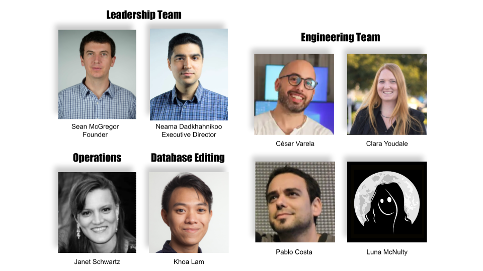

Estamos emocionados de compartir con nuestra comunidad de colaboradores preocupados por la seguridad de la IA que la Responsible AI Collaborative (RAIC, por sus siglas en inglés) alcanzó su dotación completa el martes 12 de julio, con nuestra primera reunión virtual de todo el personal. El fundador Sean McGregor dio la bienvenida al grupo proveniente de California, Rhode Island, Uruguay y Vietnam al reconocer que "ya somos una operación global" y hacer un llamado a la acción para que RAIC haga del mundo un lugar mejor asegurando lecciones difíciles sobre los límites. de la IA no se experimentan repetidamente en todo el mundo.

RAIC es la [nueva organización sin fines de lucro](https://docsend.com/view/2vetgz64m98c85xz) detrás de la [Base de datos de incidentes de inteligencia artificial](https://incidentdatabase.ai) (AIID) y presentará seguridad crítica y social. problemas a través de incidentes para aprender del pasado e inspirar un cambio positivo en el sector de IA de rápido crecimiento.

Durante la reunión, Sean enfatizó el espíritu de apertura y colaboración global de RAIC. Con este espíritu, una de las primeras características en las que está trabajando el equipo es la traducción automática de incidentes a varios idiomas. Otros proyectos iniciales incluyen la creación de una taxonomía para incidentes, la promoción de recursos de prevención y mitigación junto con los incidentes y el aprovechamiento del procesamiento del lenguaje natural para monitorear posibles nuevos incidentes y asociarlos con incidentes existentes según corresponda.

Si bien el AIID ahora cuenta con un equipo de personas a tiempo completo y parcial que trabajan para construir la base del intercambio global de incidentes de IA, el proyecto sigue siendo [código abierto](https://github.com/responsible-ai-collaborative/aiid) y colaborativo. La instalación de Slack de la organización ha crecido a 26 personas de boca en boca. Si desea una invitación, [comuníquese](https://incidentdatabase.ai/contact).

Además del personal inicial de 7 personas de RAIC, también nos complace anunciar que Neama Dadkhahnikoo, voluntario de AIID desde hace mucho tiempo, ahora tiene el título de Director Ejecutivo. Neama es experta en inteligencia artificial y emprendimiento, con más de 15 años de experiencia en desarrollo de tecnología en startups, organizaciones sin fines de lucro y empresas. Neama será responsable de la entidad RAIC y del liderazgo del producto.

La reunión concluyó con una discusión sobre por qué es importante este trabajo y cómo RAIC puede tener un impacto directo en la vida de las personas al prevenir futuros daños causados ​​por la IA. En su fundación, la RAIC responderá al aforismo de Santayana “Quien no puede recordar el pasado está condenado a repetirlo”… con datos.

El personal a tiempo completo y parcial incluye:

- [Sean McGregor](https://seanbmcgregor.com) – Fundador, Editor y Producto
- [Neama Dadkhahnikoo](http://linkedin.com/in/neama) – Director Ejecutivo, Entidad y Producto
- [César Varela](https://cesarvarela.com) – Ingeniería Web
- [Luna McNulty](https://lmcnulty.me) – Ingeniería UX
- [Pablo Costa](https://www.linkedin.com/in/pablo-costa) – Ingeniería Web
- [Clara Youdale](https://www.clarayoudale.com) – Ingeniería Web
- [Khoa Lam](http://linkedin.com/in/khoalklam) – Editor de base de datos
- [Janet Schwartz](https://www.linkedin.com/in/janet-boutilier-schwartz) – Operaciones y Estrategia