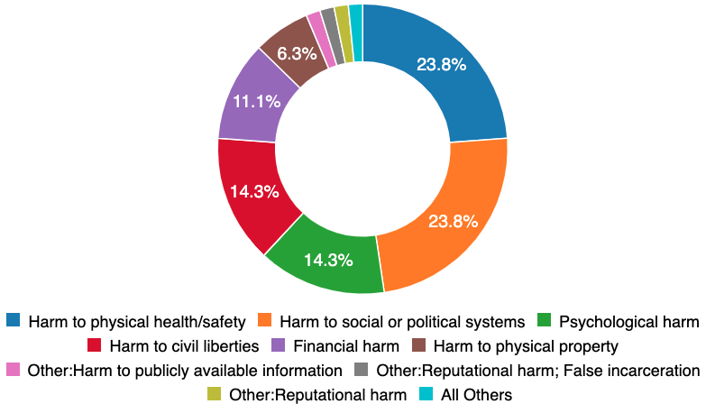
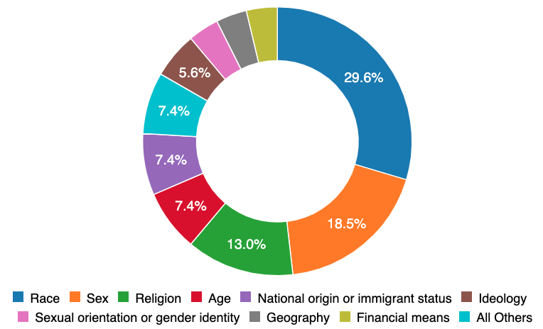

> Esta publicación de blog apareció originalmente como una [publicación invitada](https://montrealethics.ai/representation-and-imagination-for-preventing-ai-harms/) escrita para el [Montreal AI Ethics Institute](https:// montrealethics.ai/). Las clasificaciones actualizadas ahora están disponibles en la [página de taxonomía de CSET](https://incidentdatabase.ai/taxonomy/cset)

La base de datos de incidentes de IA se lanzó públicamente en noviembre de 2020 por [Partnership on AI](http://partnershiponai.org/) como un panel de control de los daños de IA realizados en el mundo real. Inspirada en bases de datos similares en la industria de la aviación, su tesis del cambio se deriva del aforismo de Santayana: “Aquellos que no pueden recordar el pasado están condenados a repetirlo”. Como una industria nueva y en rápida expansión, la IA carece de un historial formal de sus fallas y los [daños](https://incidentdatabase.ai/cite/16) comenzaban a [repetirse](https://incidentdatabase.ai/cite/ 113). Por lo tanto, la base de datos de incidentes de AI archiva incidentes que detallan un [verificador de imágenes de pasaporte que les dice a los asiáticos que tienen los ojos cerrados](https://incidentdatabase.ai/cite/48), los [sesgos de género de los modelos lingüísticos](https://incidentdatabase. ai/cite/59), y la [muerte de un peatón de un coche autónomo](https://incidentdatabase.ai/cite/4). Hacer que estos incidentes sean [detectables](https://incidentdatabase.ai/apps/discover) para futuros desarrolladores de IA reduce la probabilidad de recurrencia.

## ¿Qué hemos aprendido?

Ahora, con una gran colección de [incidentes de IA](https://incidentdatabase.ai/summaries/incidents) y una nueva función de [taxonomía de incidentes](https://incidentdatabase.ai/taxonomy/cset) del [Center for Security and Emerging Technology](https://cset.georgetown.edu/), tenemos una idea de nuestra historia y vale la pena destacar dos estadísticas.

En primer lugar, los tipos de daños que se observan en el mundo real son muy variados. Los procesos sociales existentes (p. ej., pruebas de laboratorio formales y certificación independiente) están preparados para responder solo al 24 % de los incidentes relacionados con [salud y seguridad física](https://incidentdatabase.ai/apps/discover?classifications=CSET%3AHarm %20Tipo%3AHar%20a%20físico%20salud%2Fseguridad). Si bien un automóvil autónomo plantea desafíos de seguridad obvios, los [daños a los sistemas políticos y sociales] ), [psicología](https://incidentdatabase.ai/apps/discover?classifications=CSET%3AHarm%20Type%3APsychological%20harm) y [libertades civiles](https://incidentdatabase.ai/apps/discover?classifications =CSET%3AHarm%20Type%3AHarm%20to%20civil%20liberties) representan más de la mitad de los incidentes registrados hasta la fecha. Es probable que estos incidentes sean fallas de imaginación o fallas de representación. Marquemos las "fallas de la imaginación" con la observación de que la mayoría de los incidentes no se distribuyen de manera uniforme entre todos los datos demográficos dentro de la población.

De estos daños “desigualmente distribuidos”, el 30 por ciento se distribuye según la raza y el 19 por ciento según el sexo. Muchos de estos incidentes podrían haberse evitado sin necesidad de un ejemplo en el mundo real si los equipos que diseñan los sistemas tuvieran una identidad demográfica más variada.

Entonces, ¿es la representación una panacea para los daños de los sistemas inteligentes? No. Incluso si fuera posible tener todas las identidades representadas, todavía habrá incidentes que demuestren los límites de nuestra imaginación colectiva. Para estos "fallos de la imaginación", la base de datos de incidentes de IA está lista para garantizar que solo ocurran una vez.

## ¿Lo que sigue?

Si compara la base de datos de incidentes de IA con la [base de datos de vulnerabilidades y exposiciones comunes](https://cve.mitre.org/) y la [base de datos de accidentes de aviación de EE. UU.](https://www.ntsb.gov/_layouts/ntsb .aviation/index.aspx) tienen software, procesos, integraciones comunitarias y autoridades extensos acumulados a lo largo de décadas de inversión pública y privada. Comparativamente, la base de datos de incidentes de IA está solo al comienzo de su trabajo, lo que garantiza que la IA sea más beneficiosa socialmente. Tres áreas temáticas son particularmente importantes para construir sobre los primeros éxitos del AIID en su forma actual. Éstos incluyen,

1. **Gobierno y proceso.** El AIID opera dentro de un espacio que carece de definiciones establecidas y ampliamente aceptadas de las tecnologías, los procesos de respuesta a incidentes y los impactos en la comunidad. La regularización de estos elementos con un organismo de supervisión compuesto por expertos en la materia en el espacio garantiza un producto de trabajo de calidad y la adopción en los ámbitos corporativo y gubernamental.

2. **Ampliación de la profundidad técnica.** La base de datos de incidentes de IA no ofrece una fuente canónica de verdad con respecto a los incidentes de IA. De hecho, las partes razonables tendrán razones bien fundadas de por qué un incidente debe informarse o clasificarse de manera diferente. En consecuencia, la base de datos admite múltiples perspectivas sobre los incidentes mediante la ingesta de múltiples informes (hasta la fecha, 1199 autores f