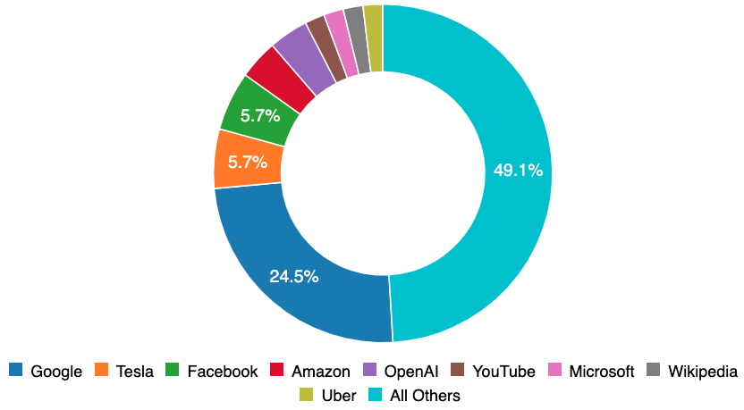

En noviembre, [Partnership on AI](http://partnershiponai.org/) AI Incident Database (AIID) invitó públicamente a los usuarios a [buscar al instante](/apps/discover) en miles de páginas de texto para comprender mejor las limitaciones de Productos de IA en el mundo real. Desde noviembre, decenas de miles de personas de 157 países se han conectado al AIID. El día de hoy marca el lanzamiento de la [próxima etapa](/research/2-roadmap) de la base de datos de incidentes de IA con su primera [taxonomía de incidentes de IA](/research/4-taxonomias) completa.

## Multiples perspectivas

El AIID no ofrece una fuente canónica de verdad con respecto a los incidentes de IA. De hecho, las partes razonables tendrán razones bien fundadas de por qué un incidente debe informarse o clasificarse de manera diferente. En consecuencia, el AIID admite múltiples perspectivas sobre incidentes, ya sea mediante la ingesta de múltiples informes (hasta la fecha, [1199 autores de 547 publicaciones](/summaries/leaderboard)) y mediante el respaldo de múltiples taxonomías. La primera taxonomía presentada por AIID es, por lo tanto, el trabajo de una colaboración con el [Centro para la Seguridad y Tecnología Emergente](https://cset.georgetown.edu/) (CSET) en Georgetown, que definió y aplicó su propia taxonomía a través de todas las incidencias admitidas en la base de datos. La taxonomía CSET [proporciona una vista de muchas facetas](/taxonomy/cset) de los datos y se detalla en su [página de taxonomía](/taxonomy/cset). También sirve como base para su [manual sobre accidentes de IA](https://cset.georgetown.edu/publication/ai-accidents-an-emerging-threat/).

## Sesgos de recopilación

La función de Partnership on AI, AIID o sus editores no es ser la fuente principal de estudios a partir de los datos de incidentes, sino proporcionar recursos e infraestructura para el descubrimiento de incidentes y estudios. Sin embargo, en el lanzamiento de este producto de datos es necesario proporcionar un contexto adicional.

**Sesgos geográficos**. Los datos de incidentes dentro de la base de datos actualmente reflejan los sesgos geográficos de los remitentes de incidentes, que se basan principalmente en el mundo de habla inglesa. En el futuro admitiremos la traducción automática y otras funciones que permitan un mayor intercambio entre idiomas, pero en la actualidad la base de datos solo está en inglés.

**Sesgo de la empresa**. Gran parte de los datos originales del AIID fueron informados por personas que trabajan en organizaciones asociadas. Este es un factor importante que contribuye al hecho de que Google, Facebook, Amazon, OpenAI, YouTube y Microsoft se encuentran entre las principales empresas informadas. Incluso con el muestreo más intensivo de las organizaciones de la Asociación, más de la mitad de los incidentes de AIID pertenecen a sistemas desarrollados por organizaciones mucho más pequeñas. La IA ya está en todas partes y nos corresponde a todos aprender de sus fallas que ocurren en cualquier parte del mundo.

## ¿Qué puedes hacer con esto?

Puede ayudar a corregir los sesgos de informes de incidentes incrustados en los datos enviando informes de incidentes o escribiendo su propia taxonomía para incluirla junto con la taxonomía CSET. Un incidente experimentado por primera vez en Hyderabad pronto llegará a Hamburgo (y viceversa) si no trabajamos para aprender de nuestros fracasos colectivos y hacer un mundo mejor.

- Explorar incidentes dentro de la taxonomía, incluyendo:
    - [Aquellos con impacto dispar según la raza](/apps/discover?classifications=CSET%3AHarm%20Distribution%20Basis%3ARace)
    - [Los producidos por organizaciones asociadas](/apps/discover?classifications=CSET%3ASystem%20Developer%3AAmazon%7C%7CCSET%3ASystem%20Developer%3AGoogle%7C%7CCSET%3ASystem%20Developer%3AMicrosoft%7C%7CCSET%3ASystem%20Developer%3AOpenAI%7C%7CCSET%3ASystem%20Developer%3AFacebook%7C%7CCSET%3ASystem%20Developer%3AYouTube)
    - [Aquellos que dañaron sistemas sociales o políticos](/apps/discover?classifications=CSET%3AHarm%20Type%3AHarm%20to%20social%20or%20politic%20systems)
- [Proponer una nueva taxonomía](/contact)
- [Descargar una instantánea semanal de la base de datos completa](/research/snapshots)
- [Enviar un nuevo incidente](/apps/submit)
- [Abrir una solicitud de extracción](https://github.com/PartnershipOnAI/aiid)

## Crédito y agradecimientos

La taxonomía CSET y el desarrollo del sistema AIID asociado son la colaboración de [Zachary Arnold](https://cset.georgetown.edu/staff/zachary-arnold/), [Sean McGregor](https://seanbmcgregor.com/) , [Helen Toner](https://cset.georgetown.edu/staff/helen-toner/), [Alex Friedland](https://cset.georgetown.edu/staff/alex-friedland/), [Alexandru Muscă ](https://github.com/alexmcode), y un grupo rotatorio de estudiantes de [Georgetown](https://www.georgetown.edu/) encargados de llenar la taxonomía de los incidentes en la base de datos. Los comentarios sobre la taxonomía CSET deben dirigirse a Helen Toner (cset@georgetown.edu 547 publicaciones), y al admitir múltiples taxonomías para las cuales la taxonomía CSET es un ejemplo temprano. Las taxonomías AIID son colecciones flexibles de clasificaciones gestionadas por personas y organizaciones expertas. Las taxonomías son los medios por los cuales la sociedad trabaja colectivamente para comprender tanto los incidentes individuales como las [estadísticas a nivel de población](https://incidentdatabase.ai/taxonomy/cset) para estas clasificaciones. Las taxonomías de incidentes de IA bien estructuradas y rigurosamente aplicadas tienen la capacidad de informar las prioridades de investigación y formulación de políticas para una IA más segura, así como ayudar a los ingenieros a comprender las vulnerabilidades y los problemas producidos por sistemas inteligentes cada vez más complejos.
La [taxonomía CSET](https://incidentdatabase.ai/taxonomy/cset) es una taxonomía general de incidentes de IA que involucra varias etapas de revisión y auditoría de clasificación para garantizar la coherencia entre los anotadores. La intención detrás de la taxonomía CSET es informar a los responsables políticos de los impactos. Incluso con el éxito de la taxonomía CSET para los formuladores de políticas, el AIID aún carece de una taxonomía técnica rigurosa. Muchas clasificaciones técnicas que informan dónde es probable que la IA produzca incidentes futuros no se capturan actualmente. Identificar la IA insegura y motivar el desarrollo de una IA segura requiere una clasificación técnica.

3. **Ampliar la amplitud de la base de datos.** La base de datos de incidentes de IA se basa en una base de datos de documentos y una colección de aplicaciones de navegador sin servidor. Esto significa que la base de datos es altamente extensible a nuevos tipos de incidentes y escalable a una gran cantidad de informes de incidentes. En definitiva, la arquitectura de la base de datos anticipa la necesidad de registrar un número cada vez mayor de incidentes de IA muy variados y complejos. Si bien la comunidad de código abierto ha proporcionado una gran cantidad de incidentes que se encuentran actualmente en la base de datos, sabemos que actualmente nos faltan muchos incidentes que deberían incluirse en los criterios actuales. Esta es un área en la que todos tienen un papel en el desarrollo exitoso de nuestra perspectiva colectiva en incidentes de IA.

## ¿Como puedes ayudar?

La base de datos de incidentes de IA no tendrá éxito sin su aporte de incidentes y análisis. Cuando encuentre un incidente de IA en el mundo, le rogamos que [envíe un nuevo incidente](https://incidentdatabase.ai/apps/quickadd) registre en la base de datos. Además, pedimos que los ingenieros de software y los investigadores trabajen con la [base de código](https://github.com/PartnershipOnAI/aiid) y el [conjunto de datos](https://incidentdatabase.ai/research/snapshots) para diseñar un futuro para la humanidad. que se beneficia al máximo de los sistemas inteligentes.