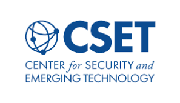
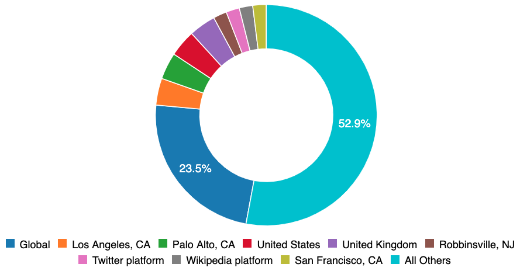
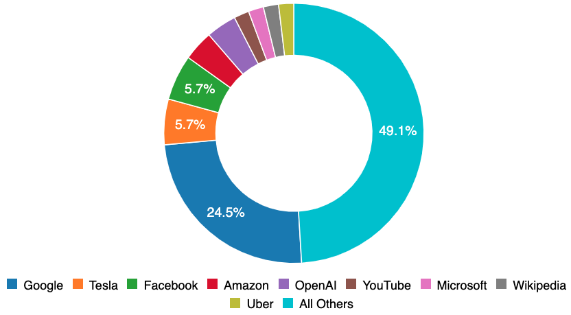

En novembre, la [Partnership on AI](http://partnershiponai.org/) et AI Incident Database (AIID) a publiquement invité les utilisateurs à [rechercher instantanément](/apps/discover) parmi des milliers de pages de texte afin de mieux comprendre les limites de Produits d'IA dans le monde réel. Depuis novembre, des dizaines de milliers de personnes de 157 pays se sont connectées à l'AIID. Aujourd'hui marque le lancement de la [prochaine étape](/research/2-roadmap) de la base de données des incidents d'IA avec sa première [taxonomie des incidents d'IA](/research/4-taxonomies) complète.

## Plusieurs points de vue

L'AIID n'offre pas une source canonique de vérité concernant les incidents d'IA. En effet, les parties raisonnables auront des raisons bien fondées pour lesquelles un incident devrait être signalé ou classé différemment. Par conséquent, l'AIID prend en charge plusieurs perspectives sur les incidents à la fois en ingérant plusieurs rapports (à ce jour, [1 199 auteurs sur 547 publications](/summaries/leaderboard)) et en prenant en charge plusieurs taxonomies. La première taxonomie présentée par l'AIID est ainsi le fruit d'une collaboration avec le [Center for Security and Emerging Technology](https://cset.georgetown.edu/) (CSET) à Georgetown, qui a défini et appliqué sa propre taxonomie à travers tous les incidents admis dans la base de données. La taxonomie CSET [fournit une vue à plusieurs facettes](/taxonomy/cset) des données et est détaillée sur sa [page de taxonomie](/taxonomy/cset). Il sert également de base à leur [introduction aux accidents d'IA](https://cset.georgetown.edu/publication/ai-accidents-an-emerging-threat/).

## Biais de collecte

Ce n'est pas le rôle de Partnership on AI, de l'AIID ou de ses éditeurs d'être la principale source d'érudition à partir des données d'incident, mais plutôt de fournir des ressources et une infrastructure pour la découverte d'incidents et l'érudition. Cependant, lors du lancement de ce produit de données, il est nécessaire de fournir un contexte supplémentaire.

**Biais géographiques**. Les données d'incident dans la base de données reflètent actuellement les biais géographiques des auteurs d'incidents, qui sont en grande partie basés dans le monde anglophone. À l'avenir, nous prendrons en charge la traduction automatique et d'autres fonctionnalités permettant un plus grand partage inter-langue, mais à l'heure actuelle, la base de données est uniquement en anglais.

**Piarité de l'entreprise**. Une grande partie des données originales de l'AIID ont été rapportées par des personnes travaillant dans des organisations partenaires. C'est un contributeur majeur au fait que Google, Facebook, Amazon, OpenAI, YouTube et Microsoft figurent tous parmi les principales entreprises signalées. Même avec l'échantillonnage plus intensif des organisations du Partenariat, plus de la moitié des incidents AIID concernent des systèmes développés par des organisations beaucoup plus petites. L'IA est déjà partout et il nous incombe à tous d'apprendre de ses échecs qui se produisent partout dans le monde.

## Que pouvez-vous faire avec ça ?

Vous pouvez aider à corriger les biais de signalement d'incident intégrés dans les données en soumettant des rapports d'incident ou en écrivant votre propre taxonomie à inclure aux côtés de la taxonomie CSET. Un incident vécu pour la première fois à Hyderabad se retrouvera bientôt à Hambourg (et vice versa) si nous ne travaillons pas pour apprendre de nos échecs collectifs et créer un monde meilleur.

- Explorer les incidents au sein de la taxonomie, y compris :
    - [Ceux qui ont un impact disparate selon la race](/apps/discover?classifications=CSET%3AHarm%20Distribution%20Basis%3ARace)
    - [Ceux produits par des organisations partenaires](/apps/discover?classifications=CSET%3ASystem%20Developer%3AAmazon%7C%7CCSET%3ASystem%20Developer%3AGoogle%7C%7CCSET%3ASystem%20Developer%3AMicrosoft%7C%7CCSET%3ASystem% 20Développeur%3AOpenAI%7C%7CCSET%3ASystem%20Développeur%3AFacebook%7C%7CCSET%3ASystem%20Developer%3AYouTube)
    - [Ceux qui ont nui aux systèmes sociaux ou politiques](/apps/discover?classifications=CSET%3AHarm%20Type%3AHarm%20to%20social%20or%20political%20systems)
- [Proposer une nouvelle taxonomie](/contact)
- [Téléchargez un snapshot hebdomadaire de la base de données complète](/research/snapshots)
- [Soumettre un nouvel incident](/apps/submit)
- [Ouvrir un pull request](https://github.com/PartnershipOnAI/aiid)

## Crédit et remerciements

La taxonomie CSET et le développement du système AIID associé sont la collaboration de [Zachary Arnold](https://cset.georgetown.edu/staff/zachary-arnold/), [Sean McGregor](https://seanbmcgregor.com/) , [Helen Toner](https://cset.georgetown.edu/staff/helen-toner/), [Alex Friedland](https://cset.georgetown.edu/staff/alex-friedland/), [Alexandru Musca ](https://github.com/alexmcode), et un groupe tournant d'étudiants de [Georgetown](https://www.georgetown.edu/) chargés de remplir la taxonomie des incidents dans la base de données. Les commentaires concernant la taxonomie CSET doivent être adressés à Helen Toner (cset@georgetown.edu). Les questions et commentaires concernant l'AIID doivent être adressés à Sean McGregor (taxonomy@seanbmcgregor.com).
