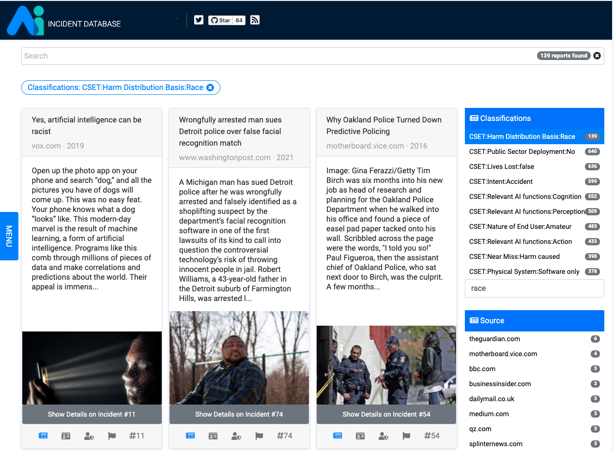
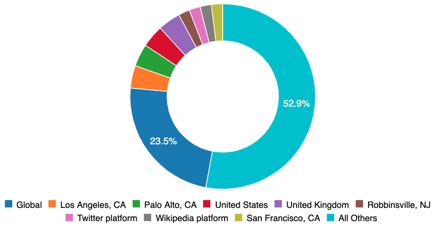

In November the [Partnership on AI](http://partnershiponai.org/) AI Incident Database (AIID) publicly invited users to [instantly search](/apps/discover) through thousands of pages of text to better understand the limitations of AI products within the real world. Since November, tens of thousands of people from 157 countries have connected to the AIID. Today marks the launch of the [next stage](/research/2-roadmap) of AI Incident Database with its first complete [AI incident taxonomy](/research/4-taxonomies).

## Multiple Perspectives

The AIID does not offer one canonical source of truth regarding AI incidents. Indeed, reasonable parties will have well-founded reasons for why an incident should be reported or classified differently. Consequently, the AIID supports multiple perspectives on incidents both by ingesting multiple reports (to date, [1199 authors from 547 publications](/summaries/leaderboard)), and by supporting multiple taxonomies. The first taxonomy presented by the AIID is thus the work of a collaboration with the [Center for Security and Emerging Technology](https://cset.georgetown.edu/) (CSET) at Georgetown, which defined and applied their own taxonomy across all incidents admitted to the database. The CSET taxonomy [provides a many faceted view](/taxonomy/cset) into the data and is detailed on its [taxonomy page](/taxonomy/cset). It also serves as the basis for their [primer on AI accidents](https://cset.georgetown.edu/publication/ai-accidents-an-emerging-threat/).

## Collection Biases

It is not the role of Partnership on AI, the AIID, or its editors to be the primary source of scholarship from the incident data, but rather to provide resources and infrastructure for incident discovery and scholarship. However, at the launch of this data product it is necessary to provide additional context.

**Geographic Biases**. The incident data within the database currently reflects the geographic biases of incident submitters, which are largely based in the English speaking world. In the future we will support machine translation and other functionality allowing for greater cross-language sharing, but at present the database is English-only.

**Company Bias**. Much of the original data for the AIID was reported by people working at partner organizations. This is a major contributor to the fact that Google, Facebook, Amazon, OpenAI, YouTube, and Microsoft are all among the top reported companies. Even with the more intensive sampling of Partnership organizations, more than half of AIID incidents pertain to systems developed by much smaller organizations. AI is already everywhere and it is incumbent upon us all to learn from its failures happening anywhere in the world.

## What Can You Do With This?

You can help correct for incident reporting biases embedded within the data by submitting incident reports or writing your own taxonomy for inclusion alongside the CSET taxonomy. An incident first experienced in Hyderabad will soon find its way to Hamburg (and vice versa) if we do not work to learn from our collective failures and make a better world.

- Explore incidents within the taxonomy, including:
    - [Those with disparate impact according to race](/apps/discover?classifications=CSET%3AHarm%20Distribution%20Basis%3ARace)
    - [Those produced by Partner Organizations](/apps/discover?classifications=CSET%3ASystem%20Developer%3AAmazon%7C%7CCSET%3ASystem%20Developer%3AGoogle%7C%7CCSET%3ASystem%20Developer%3AMicrosoft%7C%7CCSET%3ASystem%20Developer%3AOpenAI%7C%7CCSET%3ASystem%20Developer%3AFacebook%7C%7CCSET%3ASystem%20Developer%3AYouTube)
    - [Those that harmed social or political systems](/apps/discover?classifications=CSET%3AHarm%20Type%3AHarm%20to%20social%20or%20political%20systems)
- [Propose a new taxonomy](/contact)
- [Download a weekly snapshot of the complete database](/research/snapshots)
- [Submit a new incident](/apps/submit)
- [Open a pull request](https://github.com/PartnershipOnAI/aiid)

## Credit and Acknowledgements

The CSET taxonomy and the associated AIID system development are the collaboration of [Zachary Arnold](https://cset.georgetown.edu/staff/zachary-arnold/), [Sean McGregor](https://seanbmcgregor.com/), [Helen Toner](https://cset.georgetown.edu/staff/helen-toner/), [Alex Friedland](https://cset.georgetown.edu/staff/alex-friedland/), [Alexandru Muscă](https://github.com/alexmcode), and a revolving group of [Georgetown](https://www.georgetown.edu/) students responsible for filling out the taxonomy for the incidents in the database. Comments regarding the CSET taxonomy should be directed to Helen Toner (cset@georgetown.edu). Questions and comments regarding the AIID should be directed to Sean McGregor (taxonomy@seanbmcgregor.com).
