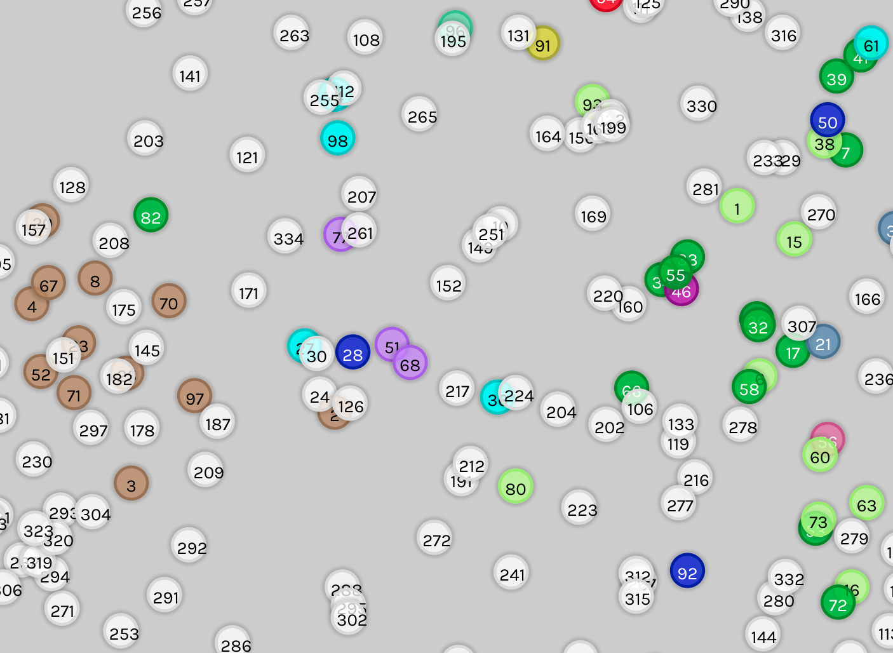
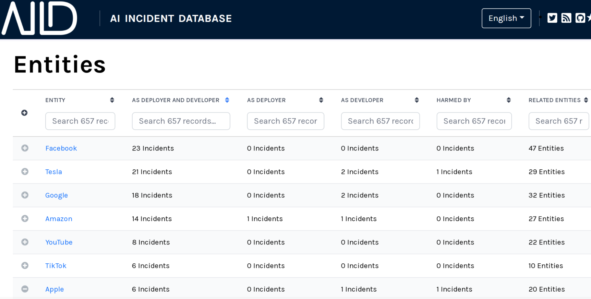

<!-- This will block quote it, which should have the effect of telling people that they can choose to read the lead in text, or not. -->

> Chaque fonctionnalité majeure de la base de données d'incidents AI (AIID) est conçue comme une série de développements incrémentiels dans le cadre "Agile", dans lequel les capacités sont fondées sur des récits d'utilisateurs détaillant les gains obtenus par la fonctionnalité. Nous mettrons en lumière ces histoires d'utilisateurs au fil du temps pour montrer comment nos efforts s'appuient les uns sur les autres pour promouvoir une IA responsable en apprenant des erreurs du passé.

Au cours du mois dernier, ingénieur expérience utilisateur (UX) [Luna McNulty](https://lmcnulty.me), éditeur de base de données [Khoa Lam](http://linkedin.com/in/khoalklam) et ingénieur full stack [ Cesar Varela](https://cesarvarela.com) ont chacun franchi des étapes importantes permettant de visualiser et de regrouper les incidents pour générer des informations sur les utilisateurs.

## Visualisation spatiale

> **Témoignage d'utilisateur** : "Je veux comprendre les clusters d'incidents afin de pouvoir motiver mon travail de {recherche, politique, plaidoyer, ingénierie}"

<figure className="p-4 text-center" style="width: 200px; float: right">
  

    
  

  <figcaption className="mt-2">Luna McNulty</figcaption>
</figure>

Une fonction clé de l'AIID est la possibilité de découvrir les incidents, d'autant plus que les incidents augmentent avec le temps. La première [taxonomie](/taxonomies) de l'AIID fournie par le Center for Security and Emerging Technology de l'Université de Georgetown a donné aux utilisateurs un outil puissant pour rechercher et découvrir par des filtres de classification, mais les rapports d'incident contiennent beaucoup plus d'informations que ce qui peut être capturé dans une seule taxonomie . L'ingénieur UX Luna McNulty a ajouté une couche au-dessus de cette taxonomie et du [modèle d'intégration d'incidents](/blog/using-ai-to-connect-ai-incidents) pour regrouper les incidents en fonction de leurs propriétés textuelles. La [visualisation des données](/summaries/spatial) trace les incidents plus près d'incidents similaires en fonction du modèle d'intégration, et les incidents sont colorés en fonction du type de classification CSET sélectionné. À mesure que le nombre d'incidents augmente et que les données sur les incidents deviennent plus riches, des moyens supplémentaires de visualiser les données aideront à raconter une histoire sur les dommages passés de l'IA.

## Témoignage d'utilisateur : Enrichir les données d'incident

> **Témoignage d'utilisateur** : "Je souhaite que les incidents aient des titres afin que je puisse m'y référer lors de discussions avec d'autres {chercheurs, décideurs, ingénieurs, personnes}"

<figure className="p-4 text-center" style="width: 200px; float: right">

  

  <figcaption className="mt-2">Khoa Lam</figcaption>

</figure>

Depuis ses débuts, l'AIID a recueilli des rapports individuels (par exemple, des articles de presse) sur les méfaits de l'IA et les a rétrospectivement regroupés dans des pages d'incidents présentant le contexte et des informations sur le même événement. Au fur et à mesure que la base de données s'est développée, il est devenu nécessaire de distiller les informations présentées par les rapports d'incidents dans des résumés complets de chaque incident. Les résumés permettent aux utilisateurs de la base de données de couper les titres à sensation en vues consensuelles de ce qui s'est passé. La figure ci-dessous montre la distinction entre les rapports et les incidents et donne un exemple de la façon dont les titres de rapport individuels se traduisent en titres d'incident composites.

![Un diagramme intitulé "Incident vs Rapport - Quelle est la différence ?" Il affiche trois onglets, chacun intitulé « Rapport », s'étendant à partir d'une zone pleine largeur intitulée « Incident AIID ». Le contenu de la boîte de l'incident se lit comme suit : "Tesla Model 3 Sedan on Autopilot Killed Motorcyclist in a Rear-Eng Collision in Utah". Les onglets du rapport se lisaient, respectivement, "Un motocycliste meurt sur l'I-15 après que Tesla sur pilote automatique s'est écrasé à l'arrière d'un vélo / 23 juillet 2022 / ABC4", "Un conducteur Tesla utilisant un pilote automatique tue un motocycliste, provoquant une autre enquête de la NHTSA / 27 juillet, 2022 / The Verge », et « L'agence américaine sonde Tesla s'écrase sur les 2 motards tués / 4 août 2022 / AP News »
](images/incident-vs-rapport.png)

L'éditeur de base de données Khoa Lam a systématiquement travaillé sur tous les enregistrements d'incidents pour ajouter des titres, des descriptions et des parties présumées {déployeurs, développeurs, parties lésées}. Les nouvelles métadonnées ouvrent des opportunités pour de nombreux développements futurs de bases de données pour regrouper et présenter les incidents de manière à alimenter les informations et les tendances des dommages causés par l'IA.

Ces deux témoignages d'utilisateurs soutiennent en fin de compte notre mission de créer des pratiques d'IA responsables en comprenant le passé, mais nous voulons également favoriser une culture de responsabilité pour répondre aux incidents après qu'ils se produisent. Cela nous amène à la dernière histoire d'utilisateur du billet de blog avec les développements de Cesar.

## Témoignage d'utilisateur en vedette : Pages d'entité

> **User Story** : "Je souhaite voir des pages résumant mon organisation en fonction des incidents auxquels nous sommes associés afin de pouvoir développer un programme atténuant les effets"

<figure className="p-4 text-center" style="width: 200px; float: right">

  

  <figcaption className="mt-2">Cesar Varela</figcaption>

</figure>

S'appuyant sur le travail de Khoa enrichissant les incidents avec des métadonnées clés, l'ingénieur full stack Cesar Varela a développé [un moyen de visualiser les incidents regroupés par "entité"](/entities). Les visiteurs de la base de données peuvent afficher des pages mettant en évidence les incidents générés et traités par diverses entreprises. Dans une future version, nous fournirons à ces entités la possibilité d'ajouter des réponses aux incidents (c'est-à-dire des détails de leur point de vue sur ce qui s'est passé, pourquoi cela s'est produit et ce qu'ils feront pour prévenir/atténuer sa récurrence). En tant que pratique de construction d'un sens collectif des responsabilités pour les futurs incidents d'IA, ces processus de réponse sont essentiels à la production et au déploiement de systèmes d'IA socialement bénéfiques.

## Vous cherchez à creuser plus profondément ?

Notre objectif n'est pas seulement d'être un référentiel d'incidents d'IA, mais de contribuer à la mission de développement et de déploiement responsables de l'IA avec une présentation des données à l'appui des informations. Si vous avez une idée pour une nouvelle façon de visualiser ou de rechercher des incidents, veuillez [nous contacter](/contact) !

